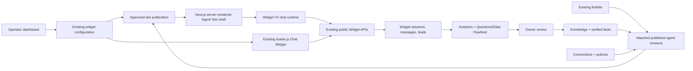

# Agent Sites on Widget V2: Product and Architecture Roadmap

Last updated: 2026-08-12

Status: Proposed source of truth; awaiting approval; no application implementation has started from this roadmap

Companion document: [Implementation Plan](./agent-native-websites-implementation-plan.md)

Current-product relationship: the Milo single-agent experience and Website Chat are implemented. This roadmap is the proposed future native website/Agent Site delivery mode for that same Milo. It must not introduce a second Milo, duplicate Knowledge or Connections, or imply that Agent Site is already shipped.

## 1. Executive Decision

Agentergroup will build its Agent Site product on top of the Milo customer-facing system that already exists:

- the `widgets` deployment model in the main Next.js application
- the independently deployed `apps/widget-v2` chat runtime
- the current Agent Builder, published agent versions, Knowledge, Connections, conversations, leads, analytics, and Questions/Data Flywheel

The product has two delivery modes:

1. **Agent Site** — the primary product: a standalone, public, SEO-capable website centered on the AI conversation.
2. **Chat Widget** — the secondary option: the same customer-facing experience embedded in an existing website.

These are not separate Milos and must not require duplicated instructions, Knowledge, Connections, Leads, or Analytics. They are two ways to deliver the same primary Milo through the widget-owned delivery foundation. Classic multi-agent data may remain compatible underneath, but the Milo product journey stays singular.

The current hosted Widget V2 experience is the foundation for Agent Site. It will be improved with a server-rendered public page shell, approved supporting content, SEO, custom domains, and clearer management UI. It will not be replaced by a second website runtime or a general-purpose page builder.

## 2. Product Vision

The core product promise is:

> Launch an AI-first business website that understands the business, answers visitors using approved knowledge, uses the business's connected capabilities, and improves through owner-reviewed real customer demand.

The Agent Site starts as a universal chat-first experience similar to ChatGPT. It is not designed for a specific niche. A business may optionally show compact supporting sections such as services, FAQs, proof, contact information, policies, or an About section, but the conversation remains the main interface.

The product's advantage over a traditional website is not unlimited visual design. It is the connected, continuously improving business agent:

- Builder defines its behavior.
- Knowledge grounds its answers.
- Connections give it approved capabilities.
- Conversations and leads show real visitor demand.
- Questions/Data Flywheel identifies missing knowledge.
- Owners review and approve improvements.
- Agent Site and Chat Widget immediately benefit from the same approved improvements.

## 3. Fixed Product Decisions

The following decisions are fixed for this roadmap:

1. The product is universal and industry-neutral. Selecting a niche is not a prerequisite.
2. Agent Site is the primary commercial focus.
3. Chat Widget remains a supported delivery option.
4. A customer may enable Agent Site, Chat Widget, or both.
5. The existing Widget V2 runtime remains a separate deployable application inside this repository.
6. The main Next.js application remains the dashboard, control plane, public SEO shell, API host, and custom-domain router.
7. The existing Agent Builder remains the place where users configure prompts, knowledge, tools, and supported connections.
8. Knowledge, Connections, conversations, leads, analytics, and the Questions/Data Flywheel are reused rather than recreated.
9. Existing widgets, public keys, embeds, sessions, leads, and histories must remain compatible.
10. Automation continues to work, but new Automation product development is paused during this roadmap.
11. Internal Assistant is not a focus of this roadmap.
12. No full drag-and-drop website builder, arbitrary custom code, plugin marketplace, or niche-specific page system will be built.
13. Visual customization is deliberately limited to a polished responsive template, branding, theme, content selection, and a small number of layout choices.
14. AI-generated or inferred business claims never publish automatically. The owner must approve public content and verified facts.
15. A new canonical `Agent Site` agent type, a parallel Agent Site frontend, and a duplicate conversation system are not required for the MVP.

## 4. Product Terminology

| Term | Meaning |
| --- | --- |
| Milo | The workspace's primary customer-facing `agents` record, configured in Milo Builder |
| Website Chat | Current hosted and embedded Widget V2 delivery and configuration surface |
| Agent Site | Standalone public delivery mode of an existing widget configuration |
| Chat Widget | Embedded delivery mode of the same Website Chat configuration |
| Widget V2 | The shared chat interface/runtime in `apps/widget-v2` |
| Platform URL | Agentergroup-hosted URL used before or without a custom domain |
| Custom domain | Verified customer hostname routed to the Agent Site |
| Supporting content | Approved server-rendered sections outside the chat, such as FAQ, services, About, proof, contact, and policies |
| Publish | Explicit operation that makes approved site content and current widget deployment state public |

Database terminology does not need to match every product label immediately. The existing `widgets`, `widget_agents`, and `widget_sessions` model remains canonical while the UI may describe its two delivery modes more clearly.

## 5. What Already Exists

The repository audit confirms that Agentergroup already has a strong foundation.

### 5.1 Widget control plane

The main application already provides:

- `/widgets` list and creation
- `/widgets/[id]` configuration
- appearance and branding
- attached agent selection and ordering
- behavior and specialist presentation
- preview drafts and signed previews
- deployment and “Needs Sync” behavior
- hosted standalone enablement
- embed snippet generation
- allowed embedded origins

Important current files include:

- `src/app/(app)/widgets/WidgetsPageClient.tsx`
- `src/app/(app)/widgets/[id]/page.tsx`
- `src/components/widgets/builder/`
- `src/app/api/widgets/`
- `src/lib/widgets/`

### 5.2 Shared Widget V2 runtime

`apps/widget-v2` is already:

- an independent Vite/React application
- deployed separately from the Next.js dashboard
- available in hosted standalone mode
- available in embedded mode through `loader.js`
- desktop-aware in hosted mode
- connected to the public Widget APIs
- protected by short-lived access tokens, origin checks, rate limits, session turn locks, and safe public errors

The runtime already distinguishes:

- `hosted`
- `embedded`
- `preview`

This distinction is sufficient for the initial Agent Site and Chat Widget attribution model:

- `hosted` represents Agent Site traffic
- `embedded` represents Chat Widget traffic
- `preview` remains internal preview traffic

### 5.3 Existing business intelligence

The current architecture already provides:

- agent drafts and published versions
- Builder configuration
- Knowledge sources, folders, ingestion, embeddings, and retrieval
- agent connection assignments
- supported Composio and direct integrations
- public widget chat APIs
- sessions, messages, uploads, completion, and lead capture
- conversation and lead analytics
- unanswered-question detection
- owner-approved verified facts
- message quotas and workspace plan controls

The new product should compose these capabilities, not reproduce them.

## 6. What Is Missing

The existing hosted Widget V2 experience is a good chat application, but it is not yet a complete Agent Site product.

The main missing capabilities are:

- a server-rendered, crawlable public page shell
- stable platform URLs with canonical behavior
- page title, description, Open Graph, canonical tags, robots rules, and sitemap
- valid JSON-LD based only on visible approved content
- optional approved sections such as FAQ, services, About, contact, proof, and policies
- a safe publish snapshot for public content and SEO
- custom-domain verification, routing, TLS, removal, and reassignment protection
- an Agent Site launch mode that composes Widget V2 without making the entire public page an iframe
- management UI that clearly separates Agent Site and Chat Widget delivery
- channel-aware analytics and conversion reporting
- performance, accessibility, operational, privacy, and abuse validation for the new public surface

## 7. Scope

### 7.1 MVP scope

The MVP includes:

- one polished, responsive, chat-first Agent Site template
- existing Widget V2 chat behavior
- platform-hosted Agent Site URL
- optional embedded Chat Widget
- shared appearance settings
- current attached-agent behavior, including single-agent and existing multi-agent widgets
- approved supporting content
- basic SEO and social metadata
- robots and sitemap behavior
- structured data only where the approved visible content supports it
- explicit preview, publish, unpublish, and rollback behavior
- channel attribution using hosted versus embedded sessions
- custom domains after the platform URL is stable
- existing leads, conversations, analytics, Knowledge, Connections, and Flywheel behavior

### 7.2 Deliberately excluded

The MVP does not include:

- niche-specific templates or workflows
- choosing a first niche
- a general website/page builder
- arbitrary layouts, custom HTML, custom JavaScript, or third-party plugins
- many templates or a template marketplace
- automatically generated location/service page farms
- automatic publication from AI, imported websites, conversations, or provider data
- automatic SEO guarantees
- a new agent type migration
- a new conversation database
- a replacement for Widget V2
- a redesign of Automation
- new Internal Assistant product work
- broad new autonomous actions merely because a connection exists
- paid-ad automation
- cross-visit personal memory

## 8. Target User Experience

### 8.1 Visitor experience

The default Agent Site is a clean, full-page chat experience:

- business logo and name
- short approved introduction
- suggested prompts
- the Widget V2 conversation
- clear AI disclosure
- contact and privacy access
- optional supporting content below or beside the conversation

The chat remains the first and most prominent interaction. Supporting content exists for trust, accessibility, search visibility, and visitors who do not want to chat.

The page must remain useful when:

- JavaScript is slow or unavailable
- the model is unavailable
- the chat API fails
- the visitor declines non-essential analytics
- the connected provider is unavailable

At minimum, the visitor must still see approved business identity, description, contact information, privacy/legal links, and any enabled supporting sections.

### 8.2 Operator experience

The current full-screen **Website Chat** area evolves into **Website Chat & Agent Site** (or another final approved label) without reintroducing an agent/widget inventory.

The widget list should eventually show:

- name
- attached agent or specialist count
- Agent Site status
- Chat Widget status
- publication/sync state
- platform or custom domain
- recent conversation/lead summary

The existing widget detail page should evolve incrementally into these responsibilities:

1. **Overview** — status, links, health, and next actions.
2. **Agent Site** — standalone enablement, platform URL, preview, and site-specific behavior.
3. **Chat Widget** — embed snippet, allowed origins, and embedded enablement.
4. **Content & SEO** — approved page content, metadata preview, FAQ, and index settings.
5. **Appearance** — reuse existing branding, theme, colors, logo, and limited layout choices.
6. **Agents & Behavior** — reuse the current attached-agent and behavior configuration.
7. **Domain** — custom-domain setup and health once that phase is available.
8. **Deployment** — preview, validation, publish/sync, rollback, and channel status.

Tabs may be combined on smaller releases, but each page must have one clear responsibility.

### 8.3 Navigation decision

A Chatbase-style global launcher and type-specific application sidebar may still be valuable later, but it is not a prerequisite for Agent Site.

This roadmap starts from the current Widget area because that is where the working customer-facing architecture already lives. A global launcher/sidebar redesign must be justified separately and must not block the Agent Site.

## 9. Target Architecture

### 9.1 Main Next.js application

The main application owns:

- authenticated Widget management
- authorization and workspace scoping
- site draft and publication services
- platform URL routing
- custom-domain hostname resolution
- server-rendered public HTML
- metadata, canonical, robots, sitemap, and structured data
- public Widget APIs
- analytics, leads, and Questions/Data Flywheel

### 9.2 Widget V2 application

`apps/widget-v2` continues to own:

- interactive chat UI
- hosted and embedded responsive behavior
- session bootstrap and token refresh
- streaming
- uploads
- lead/contact interactions
- conversation completion
- embedded loader behavior

Widget V2 may gain a dedicated `site` presentation/mount mode, but it remains the same application and uses the same public APIs. It is not copied into a new Agent Site frontend.

### 9.3 Public Agent Site composition

The Agent Site is not a blank page containing only a full-page iframe.

The Next.js response must server-render:

- approved identity and page copy
- enabled supporting sections
- contact/privacy/legal links
- metadata and structured data
- a stable chat mounting region and no-JavaScript/failure fallback

The Widget V2 runtime then mounts or loads inside the interactive chat region. Cross-origin isolation may still use an iframe for the chat client, but the complete website is a real server-rendered document rather than an iframe-only wrapper.

### 9.4 Existing embedded Chat Widget

The existing `loader.js` model remains:

- customer copies the embed snippet
- exact allowed origin is configured
- loader opens Widget V2
- the public API validates embedded bootstrap
- sessions retain the `embedded` source

No Agent Site work may break old snippets or public keys.

## 10. Canonical Data Model

### 10.1 Existing entities remain authoritative

| Entity | Responsibility |
| --- | --- |
| `agents` | Agent identity and current metadata |
| `agent_drafts` | Current Builder draft |
| `agent_versions` | Published agent snapshots |
| `widgets` | Customer-facing deployment identity, branding, delivery settings, and public key |
| `widget_agents` | Attached agents, order, presentation, behavior, and deployed agent version |
| `widget_sessions` | Public visitor sessions and delivery source |
| `widget_session_messages` | Public conversation messages |
| `widget_leads` | Public lead capture |
| Knowledge tables | Shared approved retrieval inputs |
| `connections` and `agent_connections` | Shared external capability assignments |
| `unanswered_queries` and `verified_facts` | Governed improvement workflow |

Agent Site must not create hidden duplicate agents, widgets, sessions, or knowledge stores.

### 10.2 Minimal additive site data

The recommended additive model is:

#### `widget_site_settings`

One-to-one with `widgets`.

Responsibilities:

- site enabled state
- platform slug
- draft page title and description
- approved business identity/contact fields used by the page
- generic supporting section configuration
- index preference
- social image reference
- layout variant from a small allowlist
- active publication reference

#### `widget_site_publications`

Append-only approved snapshots.

Responsibilities:

- public identity and supporting content
- SEO metadata
- enabled section order
- relevant widget appearance projection
- relevant attached published agent-version references
- schema version and content hash
- created/published/retired timestamps and actor

Public pages read the active publication, never mutable draft content.

#### `widget_domains`

One widget may have zero or more domain history records, with at most one active canonical domain.

Responsibilities:

- normalized hostname
- verification challenge and status
- routing/TLS status
- canonical and redirect behavior
- ownership history
- activation, removal, failure, and reassignment timestamps

Exact table names may change during implementation review, but the ownership boundary must remain widget-centered. Do not revive a parallel `agent_sites` ownership model.

### 10.3 Existing Phase 1 database artifacts

The linked database currently contains dormant schema added during the discarded Phase 1 direction, including canonical agent-kind/access work and dark Agent Site records.

Rules:

- do not build this roadmap on `agent_channels` or `agent_site_drafts`
- do not expose those records to the application
- do not destructively remove them as part of an unrelated feature migration
- inventory their constraints and dependencies before the first new migration
- leave safe dormant structures in place initially if removal adds risk
- retire them later only through a separately reviewed, reversible cleanup migration with verified zero application use

The current application and existing Widget architecture remain the behavioral source of truth.

## 11. Publication and Truth Model

The site needs a small but real publication boundary because search content must not change accidentally when an operator edits a draft.

### 11.1 Content classes

1. **Approved public site content** — owner-approved title, description, FAQ, services, About, proof, contact, and policies.
2. **Published agent configuration** — the agent versions already snapshotted through `widget_agents`.
3. **Live conversation state** — private visitor messages, uploads, leads, and provider results.
4. **Improvement evidence** — unanswered questions, analytics, and AI suggestions awaiting owner review.

Only class 1 belongs in public HTML, metadata, sitemap, or structured data.

### 11.2 Publish rules

- Draft edits never affect public HTML.
- AI may suggest content but cannot publish it.
- Imported content remains draft until reviewed.
- `public_ready` verified facts may be suggested for a FAQ but still require explicit site publication.
- A failed publication leaves the previous publication active.
- Publication activation is atomic from the public reader's perspective.
- Rollback selects a previous valid publication; it does not rewrite history.
- Unpublishing removes indexing and public delivery according to an explicit lifecycle state.

### 11.3 Content validation

Before publication, validate:

- required business name and description
- safe URLs and supported protocols
- content length and bounded section counts
- no unsupported markup or scripts
- no private conversation or customer data
- no unapproved AI-generated claims
- valid canonical/index settings
- structured data matches visible content
- required privacy and contact destinations
- attached widget and published agent versions still belong to the same workspace

## 12. SEO and Public Content

### 12.1 Technical SEO baseline

Every published Agent Site requires:

- server-rendered useful HTML
- unique page title and meta description
- canonical URL
- Open Graph and social metadata
- robots behavior
- sitemap entry
- correct status codes
- semantic headings
- crawlable approved supporting content
- accessible links to privacy, legal, and contact information
- mobile performance budgets

### 12.2 Structured data

JSON-LD is generated only from visible, approved fields.

Initially support only safe generic types such as:

- `Organization`
- `WebSite`
- `WebPage`
- `FAQPage` when the same FAQ is visible

More specific business/service/product/review schema is deferred until the required fields and eligibility rules are deliberately implemented.

### 12.3 Content model

The site may support these universal sections:

- introduction
- services or capabilities
- FAQ
- About
- proof/testimonials with recorded permission
- contact
- policies
- custom call to action

These are predefined typed sections. Operators may enable, disable, edit, and order them within safe limits. They cannot inject arbitrary code.

### 12.4 Index control

- previews and drafts are always `noindex`.
- unpublished or suspended sites are not indexable.
- when a custom domain becomes canonical, the platform URL follows the chosen redirect or `noindex` policy.
- campaign/query variants are not separate indexable pages by default.
- private chats, uploads, leads, and tool responses are never indexable.

## 13. Custom Domains

Custom domains are important, but they follow a stable platform-hosted Agent Site.

Required lifecycle:

1. operator enters a hostname
2. server normalizes and validates it
3. system creates a unique verification challenge
4. operator adds the required DNS record
5. system verifies ownership
6. hosting provider provisions routing and TLS
7. server activates the mapping only after verification and routing health pass
8. canonical/redirect behavior updates through a publication or controlled activation

Security requirements:

- globally unique active normalized hostname
- never trust arbitrary `Host` or `X-Forwarded-Host`
- resolve only verified active domain records
- protect against cross-tenant reassignment
- require re-verification after removal or meaningful DNS ownership change
- deterministic apex and `www` behavior
- safe certificate failure and platform-URL fallback
- immediate suspension/removal capability
- cache keys include normalized hostname and publication identity

## 14. Connections and Customer-Facing Actions

Connections remain configured through the existing Builder and connection system. Agent Site does not create a second integration layer.

However, a connected account is not automatic permission to perform every action for an anonymous visitor.

Rules:

- preserve current supported behavior unless a phase explicitly changes it
- expose only connections attached to the selected published agent version
- validate tool names and arguments server-side
- never let visitor text choose a tenant, connection, account, or hidden provider resource
- do not claim success without provider evidence
- require explicit confirmation for consequential operations
- use idempotency and durable audit records where duplicate execution could create harm
- provide a safe failure or human handoff path

The MVP does not depend on selecting a booking provider or any other niche-specific operational provider. New consequential action types require their own scoped design and security gate.

## 15. Security, Privacy, and Reliability

### 15.1 Tenant and authorization safety

- every new table is workspace-owned directly or through a constrained widget relationship
- RLS and explicit grants cover every exposed table
- server routes re-check current workspace membership and edit/publish permission
- public loaders return only an allowlisted projection
- guessed widget ids, slugs, publication ids, and hostnames never cross tenant boundaries
- service-role clients remain server-only and every privileged query is explicitly scoped

### 15.2 Browser and content safety

- validate all request bodies at runtime
- sanitize or reject unsupported rich text
- do not allow arbitrary scripts, iframes, or event handlers in public content
- enforce CSP and baseline security headers
- keep visitor APIs private/no-store
- keep published public content and visitor-specific data in separate cache paths
- retain exact-origin behavior for embedded Widget mode
- use scoped, short-lived launch/bootstrap tokens for custom-domain Agent Site chat

### 15.3 Model and retrieval safety

- treat visitor messages, imported pages, uploads, retrieved text, and provider output as untrusted data
- keep owner-approved public content separate from model suggestions
- do not send secrets or unrelated customer records to the model
- keep retrieval scoped to the attached agent and workspace
- preserve prompt-injection and cross-tenant tests

### 15.4 Privacy

- disclose that the visitor is interacting with AI
- collect only necessary visitor data
- separate essential operation from optional analytics/marketing consent
- never place private conversations or personal data in SEO content or structured data
- preserve current export/deletion/retention behavior for widget sessions and leads
- define retention for domain challenges, site drafts, publications, and logs
- record permission for testimonials, images, and other public proof

### 15.5 Abuse and cost

- retain layered rate limiting
- keep per-session turn serialization
- limit message size, uploads, supporting content, and generated suggestions
- add per-site/workspace budgets and operational alerts where necessary
- do not treat allowed origins as complete bot protection
- provide widget/site/workspace kill controls without deleting data

### 15.6 Reliability

- public approved content remains visible if chat fails
- the previous valid publication remains active if a publish fails
- Agent Site and Chat Widget can be suspended independently
- custom-domain failure does not destroy the platform URL or widget data
- Widget V2 and the Next.js application retain independent deployment and rollback paths
- shared contract changes must support compatible deployment ordering

## 16. Analytics and the Improvement Loop

The existing source model already distinguishes the delivery channel:

- `hosted` = Agent Site
- `embedded` = Chat Widget

Analytics should present customer-facing labels while retaining existing database values.

Minimum reporting:

- visitors/sessions by channel
- conversations started
- messages and completion
- leads captured
- top intent or question categories
- unanswered questions
- runtime failures
- platform URL versus custom-domain traffic
- publication version active during the session where practical

The governed improvement loop is:

1. visitor asks a question
2. the current Flywheel detects a likely gap
3. operator reviews, edits, answers, or dismisses it
4. an approved answer improves agent knowledge
5. an additional explicit choice may mark it suitable for a public FAQ
6. a new site publication is required before it becomes public SEO content

Nothing automatically changes public facts, agent instructions, connection permissions, or action policies.

## 17. Success Measures

Primary measures:

- percentage of configured widgets that publish an Agent Site
- percentage enabling both Agent Site and Chat Widget
- time from existing widget to published Agent Site
- conversation start and qualified lead/outcome rates by channel
- owner-approved knowledge improvements
- repeated unanswered-question reduction
- four-week active retention of published Agent Sites
- operator-reported saved work

Guardrails:

- zero cross-tenant data exposure
- zero private conversation content published
- zero unsupported structured-data claims
- zero known duplicate consequential actions
- no regression to existing embeds, public keys, sessions, leads, or widget analytics
- acceptable mobile performance and accessibility
- support burden and variable cost remain within agreed limits

Message count and generated content volume are diagnostics, not the product's definition of success.

## 18. Strategic Phases

| Phase | Outcome | Release level |
| --- | --- | --- |
| 0. Confirm and protect the foundation | Freeze contracts, inventory live schema, and characterize current Widget behavior | Planning/internal |
| 1. Shared delivery foundation | Establish safe Agent Site launch/channel contracts without changing the core agent model | Internal |
| 2. SEO-ready Agent Site | Ship the server-rendered platform-hosted Agent Site with approved content and Widget V2 chat | Private alpha |
| 3. Website Chat & Agent Site management | Extend the current Website Chat UI with clear Agent Site delivery controls | Private beta |
| 4. Custom domains | Add verified domain, TLS, routing, canonical, and removal lifecycle | Limited pilot |
| 5. Analytics and governed improvement | Add clear channel reporting and public-FAQ promotion through approval/publication | Pilot expansion |
| 6. Hardening and launch | Complete security, privacy, accessibility, performance, operations, and commercial validation | Limited availability |
| 7. Earned expansion | Add templates, richer sections, or new actions only when evidence supports them | Post-launch |

The companion implementation plan defines the dependency order, repository areas, verification gates, and rollback rules for each phase.

## 19. Release Gates

### Phase 0 gate

- exact current hosted and embedded flows are documented by tests
- linked database schema and migration history are reconciled
- dormant discarded Phase 1 artifacts are inventoried
- platform URL, publication boundary, site launch-token contract, and custom-domain provider are decided
- no existing customer data requires destructive migration

### Phase 1 gate

- Agent Site can be represented as hosted delivery of an existing widget
- embedded behavior remains unchanged
- channel attribution remains correct
- public launch/bootstrap cannot cross widget or workspace boundaries
- both Next.js and Widget V2 contract/build tests pass

### Phase 2 gate

- published platform URL returns useful server-rendered HTML
- drafts/previews are never indexable
- metadata, canonical, robots, sitemap, and JSON-LD match approved visible content
- Widget V2 chat works inside the site shell
- the page remains useful without chat or JavaScript
- no regression to existing hosted or embedded Widget V2

### Phase 3 gate

- existing operators can understand Agent Site versus Chat Widget
- preview, publish, hosted link, embed snippet, and sync status are clear
- Builder, Knowledge, Connections, agents, leads, and analytics remain intact
- responsive and keyboard behavior passes

### Phase 4 gate

- only verified active domains route to a tenant
- host spoofing and cross-tenant reassignment tests pass
- certificate, apex/`www`, canonical, removal, and fallback behavior are proven
- platform URL remains recoverable

### Phase 5 gate

- analytics correctly separates hosted Agent Site and embedded Chat Widget traffic
- approved knowledge changes both channels
- public FAQ content requires separate approval and publication
- no private or unapproved content becomes public

### Phase 6 gate

- security, RLS, privacy, accessibility, performance, outage, backup/restore, and abuse tests pass
- production monitoring and rollback runbooks exist
- limited customers obtain measurable value without unacceptable support cost

## 20. Prohibited Shortcuts

Do not:

1. create a second Agent Site frontend that duplicates Widget V2 chat
2. make Agent Site a new required agent kind for the MVP
3. create hidden widgets or duplicate agents to satisfy foreign keys
4. duplicate Knowledge, Connections, sessions, leads, or analytics
5. break or rotate existing widget public keys
6. force-convert existing multi-agent widgets
7. put mutable draft content directly into public HTML
8. build the complete site as an iframe-only page
9. rely on client-side meta tags for SEO
10. trust arbitrary host headers or unverified domains
11. automatically publish AI-generated content
12. inject arbitrary custom code or unsanitized HTML
13. treat a connected provider as authorization for every public action
14. combine domain activation, schema cutover, and broad public rollout in one release
15. redesign the global sidebar or Automation as a prerequisite
16. remove dormant database artifacts without a separate verified cleanup plan

## 21. Final Direction

Agentergroup does not need to start again. It already has the difficult shared foundation:

- a working customer-facing chat runtime
- hosted and embedded delivery
- configurable branding and behavior
- agents and published versions
- Builder, Knowledge, and Connections
- sessions, leads, analytics, and a governed learning loop

The correct product move is to evolve the existing hosted Widget V2 experience into a first-class Agent Site while preserving embedded Chat Widget delivery.

The simplest durable product model is:

> One existing Widget configuration, one shared set of attached agents and business intelligence, and two delivery modes: Agent Site and Chat Widget.

Agent Site becomes the primary product because it can be the business's public AI-first website. Chat Widget remains valuable because businesses may also want the same intelligence inside an existing website. Both improve together because they already share the same architecture.
