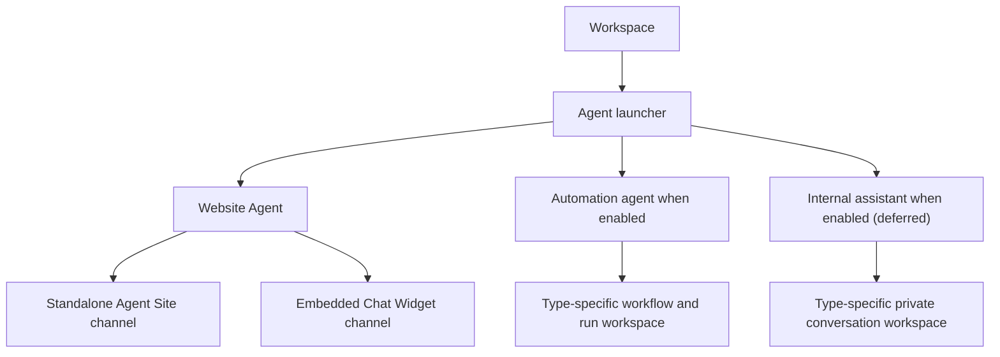
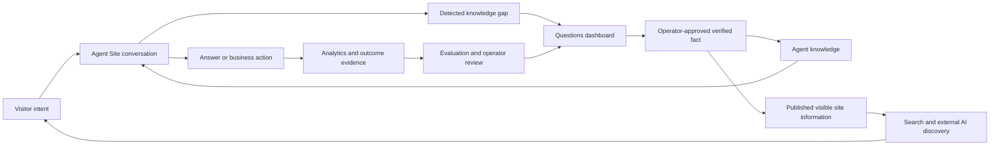
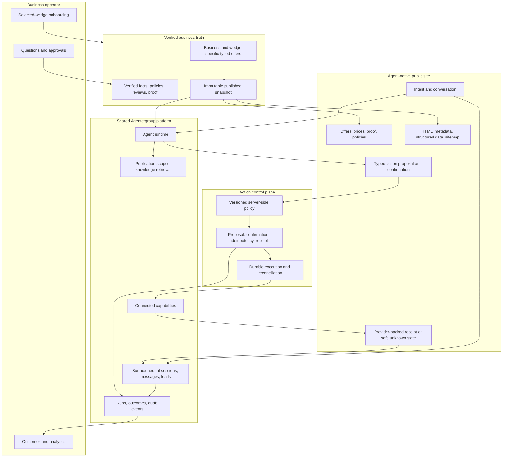

# Agent-Native Websites

Last updated: 2026-07-22

Status: Decision-ready product vision and gated implementation roadmap; not implemented

First market wedge: Not selected; Phase 0 must choose it from evidence

First customer outcome: Not selected; Phase 0 must choose one measurable end-to-end outcome for the first wedge

## Purpose

This document preserves the long-term product direction for Agentergroup and turns it into an implementation roadmap.

The central idea is simple:

> Agentergroup should let a business launch an AI agent **as its website**, not merely add an AI widget to a traditional website.

This is not a plan to use AI to generate a normal collection of Home, About, Services, and Contact pages. It is a plan for a different product category: an agent-native business website whose primary interface understands visitor intent and can perform useful work.

The existing widget remains valuable as a secondary deployment mode for businesses that keep an existing website. In the target product model, a new embedded Chat Widget is a channel of the same Website Agent that can power the standalone Agent Site; legacy widget agents remain supported until a safe coexistence/migration decision is proven. The widget is not the center of this vision.

## Executive Product Decision

Agentergroup should pursue Agent Sites as an industry-neutral platform, but it should not attempt a self-service launch for every business category at once.

The first release should be a concierge-operated design-partner pilot for **one evidence-selected wedge and one evidence-selected customer outcome**. Neither the wedge nor the outcome is chosen by this roadmap. Phase 0 must compare candidates and freeze both before production schema or public-route work.

The initial promise must use this form:

> A visitor can understand the business, receive a grounded answer or recommendation, complete the selected next step through an approved connected system when appropriate, and receive truthful evidence of the outcome.

Appointment booking is one possible reference outcome, not the assumed first product. Other valid outcomes may include a qualified lead or quote request, a support resolution, an order action, a reservation, an intake, or another bounded provider-backed task. The selected wedge and outcome must not expand informally during implementation.

The first MVP includes:

- verified business identity, offers, price guidance where relevant, people/proof, policies, location or service area, and human contact
- a useful server-rendered public experience before chat starts
- grounded discovery and guidance for the selected wedge
- a safe uncertainty, escalation, or human-handoff path
- one selected provider-backed or operator-owned outcome with freshness/status shown where relevant
- a persisted propose-confirm-execute-reconcile flow for any consequential action
- one platform URL and at least one manually operated custom-domain pilot
- basic canonical metadata, robots, sitemap, and structured business data
- consent, retention, deletion, abuse prevention, tenant isolation, and operational kill switches before public traffic

The first MVP excludes:

- additional consequential actions beyond the one Phase 0-selected outcome
- high-risk regulated workflows unless independently reviewed and explicitly approved
- complex multi-location, multi-party, resource, inventory, or capacity workflows unless required by the selected wedge and approved in Phase 0
- automatic marketing follow-up, review requests, or returning-visitor memory
- self-service onboarding, arbitrary themes, custom code, or a drag-and-drop builder
- Google Ads automation, large-scale organic-search expansion, or mass-generated landing pages
- automatic promotion of analytics, model output, or customer questions into business truth

The product is allowed to automate only after the relevant truth, identity, permission, confirmation, and provider-evidence rules are explicit.

## Roadmap Governance

This document is a gated plan, not permission to implement every phase.

Rules:

1. Phases 0-3 are a strict sequence and each requires its written success gate to pass. After Phase 3, governed Flywheel work and self-service productization may proceed as separately gated branches; growth and wedge expansion still require their stated dependencies.
2. A failed gate produces a stop, narrow, or redesign decision; it does not automatically produce more scope.
3. Product, engineering, security/privacy, and the design-partner operator must approve gates relevant to them.
4. Pilot findings, architecture decisions, exceptions, and risk acceptances belong in a dated decision log linked from this document.
5. Once Phase 0 freezes the first market wedge, outcome, provider/system of record, truth model, confirmation model, or public-data boundary, any change requires an explicit roadmap revision.
6. Security, privacy, accessibility, reliability, and rollback requirements are release criteria, not later hardening work.

## Implementation Reference Baseline

These primary references anchor the roadmap but do not freeze implementation details. Phase 0 and each release review must recheck the current versions, selected provider contract, jurisdictional applicability, and deployment-specific behavior. Legal/privacy decisions require qualified review; vendor documentation is not legal approval.

- Supabase: [Row Level Security](https://supabase.com/docs/guides/database/postgres/row-level-security), [securing the Data API](https://supabase.com/docs/guides/api/securing-your-api), and [database-function security](https://supabase.com/docs/guides/database/functions)
- Next.js: [data security](https://nextjs.org/docs/app/guides/data-security) and [Content Security Policy](https://nextjs.org/docs/app/guides/content-security-policy)
- W3C: [WCAG 2.2](https://www.w3.org/TR/WCAG22/)
- European Commission: [GDPR principles for organizations](https://commission.europa.eu/law/law-topic/data-protection/rules-business-and-organisations/principles-gdpr_en)
- Google Search: [LocalBusiness structured data](https://developers.google.com/search/docs/appearance/structured-data/local-business) and [review-snippet rules](https://developers.google.com/search/docs/appearance/structured-data/review-snippet)
- Google Tag Platform: [website consent-mode implementation](https://developers.google.com/tag-platform/security/guides/consent), relevant only after lawful measurement choices are approved
- Vercel, if retained as the deployment platform: [multi-tenant applications](https://vercel.com/kb/guide/nextjs-multi-tenant-application) and [custom-domain setup](https://vercel.com/docs/domains/set-up-custom-domain)

## Product Constitution

These principles are non-negotiable. Future implementation choices should be rejected if they move the product away from them.

1. **The agent is the primary website interface.** The public experience begins with a prominent, branded conversational surface, not a chatbot bubble in the corner.
2. **The site is chat-first, not chat-only.** Reviews, services, prices, photographs, results, location, trust signals, and other scan-friendly information remain directly visible.
3. **The site performs work.** It should answer, recommend, qualify, book, reschedule, send, create, support, order, dispatch, escalate, and follow up when connected systems and permissions allow it.
4. **One verified business truth powers everything.** Agent answers, visible sections, search-readable content, structured data, and actions must not maintain contradictory copies of business information.
5. **One Website Agent may serve multiple channels.** Its standalone Agent Site and embedded Chat Widget share governed intelligence and business truth while keeping presentation, delivery, and channel attribution separate.
6. **The business maintains knowledge, not pages.** Owners maintain durable offers, prices, policies, proof, and approved answers; connected systems remain authoritative for their live operational state. Agentergroup renders the correct public and conversational experience.
7. **The site improves through real demand.** Customer questions expose knowledge gaps. Operator-approved answers improve future conversations and can enrich the public site.
8. **Consequential actions are governed.** Permissions, confirmations, idempotency, audit history, and human handoff are product requirements, not later polish.
9. **Search visibility is earned, not promised.** Agentergroup should make verified business information fast, public, crawlable, structured, and useful. It must never promise automatic rankings or AI citations.
10. **Start with one evidence-selected wedge, expand deliberately.** The architecture stays industry-neutral, while the first complete customer outcome is narrow enough to validate safely.

## What This Product Is Not

Agentergroup Agent Sites are not:

- an AI website generator that produces a traditional site from a prompt
- a standard website template with a chat bubble added afterward
- a hosted copy of the existing widget presented as a finished website product
- a chat-only screen that forces visitors to ask for every price, service, review, or address
- an autonomous agent with unrestricted access to email, payments, orders, customer records, or other consequential tools
- an SEO content farm that generates large numbers of generic location or service pages
- a replacement for accurate business data, human accountability, or operational systems of record

## Product Thesis

Traditional business websites make visitors discover the site's information architecture and complete work manually. A visitor must find the right page, compare services, locate a form, re-enter information, and wait for a response.

An agent-native website changes the interaction model:

1. The visitor expresses an intent.
2. The site gathers only the missing context.
3. The agent uses verified business knowledge to answer or recommend.
4. Connected capabilities complete the appropriate action.
5. Visual sections provide trust, proof, and fast scanning throughout the journey.
6. The outcome and any remaining knowledge gap are recorded.

The large vision can be described as:

> WordPress made websites manageable as pages. Shopify made websites operational for commerce. Agentergroup should make business websites operational through intelligent agents.

The initial customer promise must be written only after Phase 0 selects the wedge and outcome. It should use plain outcome language, for example:

> Launch an AI website that helps visitors understand your business and complete the right next step using business-approved information.

The longer-term promise may add more actions, follow-up, payments, personalization, and compounding public knowledge only after the first selected outcome meets its safety, reliability, commercial, and operator-trust gates.

## Example Public Experience

The public homepage should feel closer to a branded ChatGPT-style business concierge than a traditional page directory.

### Primary interface

- A clear business promise and trust context
- A large conversational input such as `What can we help you with today?`
- Suggested intent starters based on the selected wedge, campaign, and available capabilities
- Streaming responses with useful visual results, not only text
- Action cards for services, staff, available times, quotes, order status, or support outcomes
- Explicit confirmation before consequential actions
- A visible path to call, message, or reach a human

### Supporting sections

Supporting sections are created from the active published business data and arranged inside the same AI website experience. Dynamic availability is a separately labeled live-provider overlay, never frozen into the publication as current truth:

- reviews and ratings
- services or products
- price guidance
- before-and-after work, portfolio, or gallery
- staff or specialists
- current availability
- service area, location, and opening hours
- policies, guarantees, certifications, and trust marks
- current offers
- contact and human-escalation options

These sections are not independent content silos. Selecting an item should bring it into the agent journey. For example, selecting an offer may prefill the conversation, show relevant proof or options, and expose a permitted next action.

### Illustrative connected-outcome journey

This is a capability pattern, not a chosen niche or promised first workflow.

A visitor says:

> I need help choosing the right option, I have a few constraints, and I want to complete the next step today.

The site should be able to:

1. Identify relevant offers, rules, and safety or eligibility boundaries.
2. Explain what can and cannot be determined from approved information.
3. Recommend or compare options using verified business truth.
4. Show relevant proof, price guidance, people, status, or other live provider data when applicable.
5. Ask only for the minimum missing information.
6. Propose the selected next action and request the required visitor or operator confirmation.
7. Let the selected system of record own the operational result it creates.
8. Capture the provider reference/evidence and show a durable truthful receipt or status.
9. Capture any concrete unanswered question as a private Flywheel candidate without publishing conversation context.

Booking, lead creation, order changes, support actions, messages, and CRM mutations are separate consequential capabilities. None is implicitly enabled merely because a connection exists. The first one remains off until Phase 0 selects it and the roadmap records its permission, consent, idempotency, failure, rollback, and evidence rules.

For the first MVP, any domain-specific scenario that cannot be resolved from an operator-approved rule must become uncertainty, a safe fallback, or human handoff. The model must not improvise professional, regulated, financial, legal, or safety-critical advice.

## Operator Experience

The existing Agent Builder remains a shared core product page. This roadmap does **not** replace it with a niche-specific builder or remove its graph, knowledge, prompt, tool, or connection capabilities. Users may continue connecting any platform Agentergroup supports, subject to plan entitlement, authorization, connection compatibility, and action policy.

The agent type changes the surrounding application, setup guidance, and available delivery/operations pages. It does not create an unrelated builder implementation for each type.

The Website Agent setup should feel like a guided business launch around the existing builder:

1. **Create the agent and business identity** — name, category, locale, contact information, operating context, and branding.
2. **Open the existing Builder** — configure behavior, knowledge, tools, and supported connections through the same builder foundation used elsewhere in the platform.
3. **Import and verify facts** — optionally ingest an existing website or structured source, but require review before facts become public truth.
4. **Configure the selected wedge's offer** — use the typed objects and defaults chosen in Phase 0 rather than hardcoding any predetermined industry or action model.
5. **Connect capabilities** — calendar, email, CRM, commerce, payments, orders, support, or any other platform Agentergroup supports.
6. **Choose permissions** — decide which actions are read-only, automatic, visitor-confirmed, or operator-approved.
7. **Preview real scenarios** — test common visitor intents and failure cases, not only visual appearance.
8. **Configure My Site and Widget** — publish the standalone Agent Site and optionally enable its embedded Chat Widget channel.
9. **Operate through outcomes** — monitor conversations, leads/contacts, actions, unanswered questions, failures, and human handoffs.

### Agent launcher and type-specific application shell

The authenticated product should use a two-level navigation model:

1. **Choose or create an agent.** The user first enters a calm Agent launcher with minimal global chrome.
2. **Operate the selected agent.** After selection, the product opens a sidebar and workspace tailored to that agent's type.

This keeps the useful parts of the current multi-agent platform while preventing one global sidebar from mixing website, automation, assistant, widget, knowledge, analytics, and integration concepts regardless of the user's task.



#### Level 1: Agent launcher

The Agent launcher is the default authenticated root, not another analytics dashboard. Before an agent is selected, the UI should show only global controls that genuinely exist above an agent:

- Agentergroup identity and workspace switcher
- `Create agent` as the one dominant action
- account, team, billing, privacy, support, and authorized admin access
- existing-agent cards or rows with name, plain-language type, lifecycle state, live/paused state, one useful outcome, highest-priority issue, and last activity

The launcher needs clear empty, loading, error, and agent-limit states. A workspace with no agents receives one guided empty state rather than an empty full sidebar. Returning users can enter an agent with one click; authorized deep links may open a selected agent directly, and every agent shell must provide a clear `All agents` or `Switch agent` control.

Creating an agent begins with purpose, not technical configuration:

| Agent type | Customer-facing explanation | Availability |
| --- | --- | --- |
| **Website Agent** | A customer-facing agent that can operate as a standalone Agent Site and inside an existing website. | Primary product focus. |
| **Automation Agent** | A background agent that reacts to an approved trigger and completes a defined workflow. | Existing builder, connections, and runtime remain supported. |
| **Internal Assistant** | A private agent for the operator or team. | Deferred from current product work; preserve existing behavior and show only when explicitly enabled. |

After the user selects a type, ask only for the minimum identity or business input needed to create a safe draft, then enter that type's shell. The existing Builder remains available after creation; model selection, prompts, tool schemas, graph nodes, and connections simply do not belong in the initial type-choice dialog.

`Agent Site` and `Chat Widget` are not additional agent types. They are channels of one Website Agent. This prevents owners from creating one agent for a standalone site and another agent for an embed, then maintaining contradictory knowledge and behavior.

#### Level 2: Selected-agent shell

Once an agent is selected, the header must keep its name, type, lifecycle state, save state, and relevant live status visible. The sidebar is generated from the selected agent type and enabled capabilities; irrelevant sections do not appear disabled or empty.

| Selected type | Default sidebar | Purpose |
| --- | --- | --- |
| **Website Agent** | `Overview`, `Builder`, `My Site`, `Widget`, `Customers`, `Improve`, `Connections`, `Settings` | Use the shared builder, then operate the customer-facing website, embedded channel, outcomes, and improvements. |
| **Automation Agent** | `Overview`, `Builder`, `Runs`, `Connections`, `Settings` | Preserve the current builder/connection model and monitor background runs without website pages. |
| **Internal Assistant** | Existing enabled routes only | No new shell redesign in the current roadmap; retain compatibility and hide it when not enabled. |

For a Website Agent:

- **Overview** answers what happened, what needs attention, and what to do next.
- **Builder** is the existing shared builder page for behavior, knowledge, tools, flows, and supported platform connections; it is preserved rather than rebuilt as a website-only editor.
- **My Site** configures and previews the standalone Agent Site channel, including its publication, presentation, domain, and delivery state.
- **Widget** configures the optional embedded Chat Widget channel, including appearance, allowed origins, embed instructions, and delivery state.
- **Customers** unifies conversations, contacts/leads, selected outcomes, handoffs, and failed or unknown actions.
- **Improve** is the governed approval inbox for customer-demand evidence and proposed improvements.
- **Connections** exposes the supported connected platforms available to that agent, while authorization and action policy still govern what each connection may do.
- **Settings** contains agent-level administration; workspace-wide team, billing, Product access, and privacy administration remain global.

The standalone Agent Site and new embedded Chat Widget channels share the Website Agent's approved business truth, effective runtime definition, permitted capabilities, action policy, and governed improvements. Channel-specific appearance and delivery configuration remain separate. Customer journeys and analytics must retain an explicit channel source. Existing standalone widget agents remain supported through a documented compatibility path until a separately verified migration exists; they must not be silently converted or deleted.

#### Admin-controlled product access

The existing admin-controlled automation and internal-assistant flags are a useful UI and data-model starting point, but they are not yet a complete authorization, entitlement, or lifecycle control. The mature product should expose a clear workspace `Product access` control for agent types and optional channels, but availability, creation, execution, and suspension must not be collapsed into one unsafe boolean.

Place this control in the internal admin shell under the selected workspace, such as `Workspace → Product access`; do not add administrative product switches to the normal customer's agent sidebar.

| Control | Meaning |
| --- | --- |
| **Offer type** | Whether the type is visible as an available product for the workspace. |
| **Allow creation** | Whether an authorized workspace user may create, import, duplicate, or instantiate that type. |
| **Allow management** | Whether existing agents remain editable or become explicitly read-only. |
| **Allow runtime** | Whether the agent may process new conversations, triggers, or runs. |
| **Allow channel delivery** | Whether a specific public/private channel may receive new traffic. |
| **Emergency suspension** | A separate audited safety action that overrides normal availability until explicitly resolved. |

- Disabling creation removes the type from `Create agent` and blocks creation server-side.
- Existing data is never deleted merely because creation is disabled.
- Read-only access, runtime execution, public delivery, and emergency suspension are separate explicit states.
- Stopping a live Agent Site, widget, assistant, or automation requires a deliberate action, reason, audit event, and accurate customer/operator fallback.
- Plan limits and feature entitlements are enforced on every privileged server mutation and execution path, not only by hiding a card or sidebar item.
- Type-specific routes must verify workspace membership, agent ownership, selected type, role capability, and current entitlement. The selected-agent id in the browser is context, never authorization.

Switching agents must not leak cached records, filters, drafts, conversations, connection state, or optimistic UI from the previous agent. Unsaved changes require an explicit leave warning. On mobile, the launcher becomes a single-column list and the selected-agent shell uses a drawer or compact navigation without changing the hierarchy.

This shell model is the target architecture from the beginning, but it does not pull self-service forward. During Phases 0-3, Agentergroup staff may pre-create the Website Agent and Agent Site channel, then invite a design partner directly into its scoped shell. Website Agent is the active product focus; Automation Agent remains supported through its existing Builder/connections/runs experience; Internal Assistant receives compatibility maintenance only. General customer creation and automated plan entitlements remain Phase 5 work.

### First-release operating model

Phases 0-3 are concierge-operated design-partner work, not self-service SaaS.

Agentergroup staff may import and structure data, configure the agent through the shared Builder, connect the selected provider, run evaluations, and publish the site together with each design-partner business. During the pilot, track every manual step and minute of operator support. Those observations define the later self-service product; they must not be hidden inside informal implementation work.

The pilot must record:

- Agentergroup setup hours per business
- business-operator review and correction time
- number of facts rejected or corrected before publication
- number and type of manual interventions after launch
- weekly operator time required to keep the site trustworthy
- support incidents, provider reconnections, and failed or ambiguous actions
- which setup decisions can become safe defaults and which require explicit operator judgment

Self-service work begins only after the end-to-end pilot is useful, safe, repeatable, and commercially credible.

## Product Validation Contract

The central product thesis must be falsifiable. Phase 0 and the design-partner pilot must compare three experiences using the same selected-wedge data and outcome capability:

1. the design partner's current public and outcome journey
2. a clear structured non-agent baseline
3. the proposed agent-first, chat-not-only experience

The comparison must include simple discovery tasks and complex fit tasks. The agent-first design must not make simple information harder to find merely to increase conversation starts.

### Required research inputs

- 5-10 operators from the working market wedge
- at least 30 moderated visitor tasks before production implementation
- real anonymized offers, pricing, policy, eligibility, live-provider, escalation, and failure scenarios relevant to the candidate wedge
- at least one qualified domain operator or expert reviewing every high-risk or suitability scenario in the launch evaluation set
- provider documentation or a provider sandbox proving the selected action's required status, evidence, idempotency, and reconciliation semantics
- an explicit price hypothesis and willingness-to-pay interviews

### Provisional validation gates

Phase 0 must ratify or revise these thresholds before production work begins:

- at least 90% of moderated visitors can find service, price guidance, location, opening hours, and human contact without starting chat
- at least 80% complete the selected complex service-fit journey without facilitator assistance
- the agent-first experience is no more than 5 percentage points worse than the structured baseline on simple discovery
- the agent-first experience improves complex qualified-outcome completion by at least 15% relative or reduces median time to the correct next step by at least 20%
- domain-reviewer agreement with recommendations or next steps is at least 90%
- recall is 100% for evaluation cases that the approved domain rules mark as escalation-required or human-only
- no fabricated price, policy, availability, professional-safety claim, or completed action appears in the evaluation set
- at least 5 suitable design partners commit to the staged pilot, with backup candidates for attrition, and at least 3 accept the tested target price range

These are product-discovery gates, not statistically final market claims. The later live pilot requires a larger outcome and commercial gate.

### Kill and narrow criteria

Stop or narrow the plan before schema expansion if:

- visitors consistently prefer the structured baseline for both simple and complex tasks
- operators will not trust the recommendation boundary or keep the truth current
- the chosen provider cannot support reliable status, outcome evidence, idempotency, and reconciliation
- the product requires unrestricted provider tools or cannot prevent false success and duplicate consequential actions
- acquisition, support, model, provider, and hosting costs cannot fit a credible price
- privacy, accessibility, or regulatory requirements cannot be met for the chosen pilot

## Compounding Data Flywheel

The existing Questions feature is the foundation of the long-term product moat.



The important distinction is between raw demand and verified truth:

- A visitor question is evidence of demand, not a fact.
- An agent answer is not automatically publishable truth.
- Analytics and outcomes may prioritize evaluation or operator review, but they do not update runtime behavior, truth, or policy directly.
- Only an authorized operator-approved fact may update durable agent knowledge or public business information.
- Facts need lifecycle states so outdated prices, policies, availability, and claims can be retired.

The current `verified_facts.visibility = public_ready` flag already anticipates this direction. It currently does not publish public content. The Agent Site roadmap should turn that flag into a governed publication pipeline rather than rendering it directly from mutable rows.

## Capability Growth

The site improves along two independent axes:

### Intelligence

- more complete verified facts
- better retrieval and grounded answers
- better understanding of common visitor intents
- better service/customer fit decisions
- improved recommendations from outcomes and operator feedback

### Capability

Each approved integration gives the site new actions:

- Calendar: find availability, book, reschedule, cancel
- Email: send confirmations, replies, and permitted follow-ups
- CRM: create leads, update customers, add notes, create tasks
- Payments: create payment links, collect deposits, report status
- Commerce: check inventory, create draft orders, report order status
- Support: retrieve context, create tickets, update and escalate cases
- Dispatch: check coverage and availability, create a job, assign a technician
- Reviews: send review requests and ingest approved public proof
- Accounting: prepare invoices or structured inputs for operator review

The governing model is:

> Business knowledge + agent reasoning + connected capabilities + explicit policies + public customer interface.

Capabilities must be introduced as bounded, outcome-specific workflows, not as an uncurated list of thousands of provider tools.

## Truth and State Model

"One verified business truth" does not mean every value belongs in one mutable row or one immutable snapshot. Agent Sites require explicit truth classes with different freshness and publication rules.

### Class 1: Draft operator truth

Mutable, private business records being edited or imported. Draft data is never available to anonymous clients, public rendering, search artifacts, or live Agent Site retrieval.

Examples:

- offer descriptions and price guidance under review
- unpublished policies
- imported website facts awaiting approval
- staff profiles awaiting publication permission

### Class 2: Published business truth

An immutable, approved snapshot used by visible sections, grounded agent context, canonical metadata, and structured data.

Examples:

- business identity and contact information
- offer descriptions, relevant fulfillment/duration guidance, price model, currency, and action requirements
- people/team profiles and domain rules approved for public use
- policies, proof, locations, opening hours, and approved public facts

Every publication must contain:

- publication id, site id, workspace id, and business id
- schema version and deterministic content hash
- locale, timezone, and currency
- immutable approved source/chunk revision manifest or publication-owned retrieval copies
- effective runtime definition snapshot or independently retained immutable agent version
- action-policy version id and explicit site/business provider binding
- generated visible projection and search projection
- artifact checksums, lifecycle state, creator, approver, creation time, and optional retirement/revocation reason

Publications are append-only. Rollback conditionally changes the active pointer after current rights, safety, provider, tombstone, and permission revalidation; it never edits an old publication or restores a withdrawn capability silently.

### Class 3: Live provider truth

Dynamic operational values read from the selected system of record. They are never copied into crawlable search content as if they were durable facts.

Examples:

- current availability, inventory, case/order state, or other approved live operational data
- whether the requested operation is still valid
- provider outcome status and reference
- connection health

Every live value shown to a visitor must include or imply a retrieval time and freshness policy. If it is stale, unavailable, contradictory, or cannot be verified, the UI must say so and offer retry or human handoff.

### Class 4: Visitor-specific transient state

The visitor's conversation, selected offer, proposed action arguments, contact details, consent, confirmation, and action state. It must not appear in shared caches, public HTML, metadata, structured data, or another visitor's session.

### Class 5: Derived evidence

Analytics, detected intents, customer questions, model suggestions, experiments, and outcome summaries are evidence, not business truth. They may create an operator review task but may not automatically change typed facts, instructions, public claims, suitability rules, or action permissions.

### Source precedence and conflict behavior

1. The selected operational system of record is authoritative for its live status and completed outcome.
2. The active publication is authoritative for visible business descriptions, price guidance, policies, and approved domain rules.
3. Typed published fields take precedence over unstructured retrieval when both describe the same operational fact.
4. A conflict between typed truth and retrieved knowledge is a publication validation error, not a prompt-engineering problem.
5. A conflict between published truth and live provider truth must fail safely: do not promise the price, availability, status, or completed action; show the known difference and hand off when necessary.
6. Model output, customer text, imported content, and tool output remain untrusted until validated against their relevant schema and source.

## Publication and Runtime Invariants

These invariants are required for the vision to be true:

1. **Draft isolation:** no draft change can affect public HTML, structured data, agent answers, tool permissions, or an in-progress visitor session.
2. **Prepared activation:** a publication moves through `building -> ready -> active -> retired | revoked`. All public, retrieval, search, runtime, and fallback artifacts are created under content-addressed version keys and checksum-validated before one short database transaction changes the active pointer. External cache invalidation is not a correctness dependency.
3. **Session pinning with bounded life:** an Agent Site conversation stores the publication id, immutable runtime definition, action-policy version, locale, and site selected at session creation. It does not silently adopt newer business claims, but session/token lifetime is capped.
4. **Live deny-only safety envelope:** suspension, deletion, provider revocation, permission loss, kill switches, critical fact/safety corrections, rights withdrawal, and emergency tombstones take effect immediately for old and new sessions. This live envelope may only remove capabilities or claims from pinned context; it cannot silently grant or add them. Revalidate it on every turn and immediately before execution.
5. **Publication-scoped retrieval:** knowledge search is restricted to append-only source/chunk revisions or publication-owned copies approved in the pinned publication. A manifest of ids pointing to mutable or cascade-deletable chunks is insufficient.
6. **Public projection:** anonymous clients never query mutable operator tables. Server code returns an explicit field-allowlisted public projection.
7. **Cache separation and last-known-good serving:** public cache keys include normalized hostname or platform slug plus publication id. Visitor-specific responses are private and never enter a shared cache. A versioned last-known-good public artifact may be served independently during database failure within an approved staleness limit, while a separately available deny-only control prevents deleted, suspended, or revoked sites from remaining live.
8. **Conditional rollback:** rollback never rewrites history, but an old publication is not automatically safe to reactivate. Revalidate current provider compatibility, source rights, deletion/tombstone state, professional-safety rules, and the live safety envelope. If rollback would change effective action capabilities, require both `site_publish` and `action_policy_manage`.
9. **Fail-closed suspension:** an unpublished, suspended, deleted, unverified-domain, or billing-restricted site cannot serve chat or new actions. Static business information may remain available only under an explicit operator, legal, safety, cache-staleness, and billing policy.
10. **Traceability:** every public claim can be traced to a typed field or immutable approved source revision, and every action can be traced to a session, proposal, confirmation, policy version, provider binding/request, and receipt.
11. **Bounded recovery:** maximum publication activation time, last-known-good staleness, RTO/RPO, queue backlog, action reconciliation delay, and restore time are Phase 0 decisions with owners, alerts, and error budgets.

## Current Foundation

The repository already contains much of the reusable platform foundation.

### Reusable today

- Existing Agents library and creation flow already establish an agent-first entry point and distinguish widget, automation, and internal-assistant surfaces
- Existing workspace admin controls, feature fields, and selected runtime checks for automation and internal-assistant availability provide a partial foundation for product-access entitlements; creation and lifecycle enforcement remain incomplete
- Agent builder, version records, and visual-configuration concepts; current client-side publishing is not the atomic Agent Site publication boundary
- Reasoning, retrieval, and tool-loop code in `src/lib/runtime/agent-chat.ts` as an extraction source; its current direct tool-execution path is not safe to reuse unchanged for visitor-confirmed consequential actions
- Public hosted/embedded chat endpoints under `src/app/api/public/widgets/[widgetPublicKey]`
- Durable widget sessions, messages, leads, uploads, presence, completion, and rate-limit patterns, while their widget-owned helpers and schema cannot become the permanent Agent Site data model
- Knowledge ingestion, semantic retrieval, folders, and agent attachments as mutable authoring inputs, not immutable publication-scoped retrieval
- Questions/Data Flywheel in `src/lib/flywheel`, `/questions`, and `/api/flywheel`
- `unanswered_queries` and `verified_facts` with workspace-scoped RLS
- Workspace-scoped connections and selected agent capabilities
- Composio tool routing for email, calendar, CRM, commerce, support-adjacent, and advertising actions
- Conversation/lead analytics and automation-decision telemetry foundations that need Agent Site outcome definitions and privacy-safe event contracts
- Hosted widget mode that proves public standalone chat delivery is possible
- Supabase authentication, workspace membership, RLS helpers, billing, and quota foundations; existing privacy operations are widget-oriented and require Agent Site adaptation before pilot traffic

### Missing for the vision

- A polished Agent launcher before the operational shell, with one-click agent selection and a guided, entitlement-aware create flow
- A selected-agent route and application context that produces type-specific sidebars without treating a browser-selected id as authorization
- A first-class channel model in which a Website Agent can provide a standalone Agent Site and optional embedded Chat Widget without duplicating the agent, approved truth, or action policy
- Explicit separation between type creation availability, read-only access, runtime execution, public delivery, and audited suspension
- A first-class Agent Site entity independent of widget semantics
- Surface-neutral public conversation ownership for Agent Sites and widgets, or a deliberate Agent Site persistence model with shared adapters; adding an `agent_site` source value to widget-owned tables is not sufficient
- A typed and versioned business-data model for visible public truth
- A public Next.js Agent Site experience with server-rendered supporting content
- An Agent Site publication and rollback lifecycle
- Publication-scoped knowledge manifests and retrieval so chat cannot read newer mutable knowledge than the visible site
- Conversation pinning to publication, immutable runtime definition, knowledge revisions, and action-policy version, plus a live deny-only safety envelope
- Custom-domain ownership, canonical URL, TLS, and routing lifecycle
- Structured section composition driven by business data
- Action-policy configuration and visitor/operator confirmation rules
- A safe action receipt and idempotency model for customer-facing operations
- A persisted proposed-action state machine and confirmation protocol that executes exact approved arguments
- Durable outbox/queue, provider webhook or polling reconciliation, and recovery for unknown outcomes
- Visitor identity and anti-abuse rules for creating or modifying consequential records
- Public rendering of approved `public_ready` facts
- Search artifacts generated from the same published snapshot
- Intent-aware Google Ads landing states and conversion attribution
- A simplified selected-wedge onboarding flow
- Agent Site-specific analytics, experiments, and success metrics
- A qualified domain-review evaluation set for recommendation, eligibility, safety, and escalation boundaries
- Agent Site-specific permission capabilities for drafting, approving facts, publishing, managing domains, and managing action policies
- Consent, retention, deletion/export, vendor-processing, and third-party measurement rules approved before public pilot traffic

### Architectural boundary

The existing hosted widget is a useful prototype and runtime source, but it is not the future product model.

The Agent Site should:

- reuse only the validated reasoning, retrieval, persistence, provider-adapter, and rate-limit primitives where appropriate
- appear in the Agent launcher as a Website Agent and open a Website Agent-specific shell after selection
- introduce its own domain entity, public rendering surface, publication snapshot, onboarding, analytics dimensions, and capability policies
- expose the standalone Agent Site and new embedded Chat Widget as channels of the selected Website Agent while keeping presentation and delivery settings channel-specific
- avoid copying the complete widget chat route into a second implementation
- avoid making `widget_id` the permanent owner of website identity or business truth
- avoid creating a hidden widget merely to satisfy current session, analytics, lead, or Flywheel foreign keys
- replace client-side multi-step publish behavior with one authorized server operation and a short database transaction or equivalent atomic function
- preserve one shared reasoning loop while inserting explicit transport-independent hooks for publication context, action proposal, policy validation, confirmation, persistence, and receipts
- provide a proposal-only runtime path that cannot fall through to the existing direct consequential tool execution path
- snapshot the effective runtime definition inside the publication or retain immutable agent versions independently of agent/publisher deletion; a foreign key to a cascade-deletable version is not durable publication history
- preserve legacy widget agents until a separately designed, reversible, verified migration can map them without changing live behavior or losing history

## Target Architecture



### Layer 1: Verified business truth

Do not store important business truth only as prompt text or opaque knowledge chunks. Searchable documents are valuable for unstructured context, but core operational facts require typed fields and validation.

The Phase 0-selected conceptual model should begin with the following industry-neutral core and add only the typed objects required by the chosen wedge:

- `businesses`: workspace-owned business identity, category, locale, timezone, currency, legal/public names, and lifecycle status
- `business_locations`: addresses, service areas, contact details, coordinates, regular opening hours, and dated exceptions
- `business_offers` or the Phase 0-approved wedge-specific equivalent: name, description, price guidance, currency, fulfillment/eligibility data, active state, action requirements, and visibility
- `business_people` or the approved equivalent when the wedge needs public staff/specialist/team profiles, roles, locations, publication permission, and provider references
- typed offer/resource relationships only when the selected outcome requires them
- `business_policies`: typed terms, preparation, eligibility, fulfillment, support, escalation, and outcome-specific policies for the first workflow
- `business_reviews`: source, source URL or provider reference, rating, text, author display rules, verification state, rights/permission state, and publication permission
- existing `verified_facts`: operator-approved long-tail answers and knowledge-gap resolution, extended when necessary with business/site scope, locale, source provenance, effective dates, review date, and retirement reason

The first schema should implement only what the Phase 0-selected wedge and outcome need. The conceptual model prevents short-term implementation from collapsing everything into unvalidated JSON or duplicated page copy, but it must not hardcode any industry, appointment, commerce, or support assumptions before selection.

Schema requirements:

- every tenant-owned row has an enforceable workspace boundary
- redundant `workspace_id` columns cannot disagree with their parent business, site, agent, session, or publication; use composite foreign keys or equivalent database constraints
- every foreign key and every column used by RLS or frequent filtering has an intentional index
- lifecycle, visibility, currency, locale, status, and risk fields use check constraints or otherwise validated bounded values
- timestamps use `timestamptz`; money uses exact numeric amounts plus currency, never floating point or unvalidated display strings
- platform URLs use unguessable public keys where authorization-by-obscurity would otherwise be tempting; human slugs are identifiers for routing, not secrets
- global normalized uniqueness exists for active hostnames, while slug uniqueness matches the approved platform URL design
- deletion behavior is explicit for every relationship; customer outcomes and audit receipts must not disappear accidentally through a broad cascade
- all imported facts retain source provenance and verification state
- all publishable media retain owner, rights/permission, alt text, and public/private state

### Layer 2: Agent Site and publication

The conceptual model should include:

- `agent_sites`: workspace, business, agent, unguessable public key, slug, locale, theme, lifecycle state, suspension reason, and active publication
- `agent_site_sections`: ordered presentation configuration referencing typed business data instead of copying it
- `agent_site_provider_bindings`: explicit site/business-to-provider connection and allowed provider resource set, so workspace-level authorization cannot select the wrong account, calendar, store, inbox, customer set, resource, or operational record
- `agent_site_action_policy_versions`: append-only effective action, provider-binding, identity, confirmation, limit, and safety policy created before any publication that references it
- `knowledge_source_revisions` and immutable chunk/retrieval revisions, or publication-owned copies: append-only content and embeddings that survive later source edits, reprocessing, detachment, retirement, and permitted deletion behavior
- `agent_site_publications`: append-only snapshot of public business data, approved facts, immutable source/chunk revision manifest, section configuration, effective runtime definition or independently retained agent version, action-policy version, schema version, lifecycle (`building`, `ready`, `active`, `retired`, `revoked`), content hash, approval metadata, and generated search metadata
- `agent_site_publication_sources`: publication-to-source/chunk revision membership with provenance, rights, effective/review dates, and emergency tombstone behavior
- `agent_site_public_artifacts`: content-addressed public HTML/data/search/fallback artifacts, checksums, build status, creation time, and bounded-staleness metadata
- `agent_site_domains`: normalized hostname, verification challenge state, certificate/routing state, canonical state, redirect policy, ownership history, and activation/removal history
- `agent_site_publication_events`: publish, rollback, suspend, restore, archive, and validation-failure history without rewriting publications

Public requests should read only the active published snapshot. Draft changes must never partially leak into a live site.

Do not grant anonymous clients direct access to mutable workspace tables. A server-side public loader should resolve the hostname/slug, confirm the site is published, load only the active snapshot, and return a deliberately public projection.

The publication builder must validate completeness, cross-record consistency, rights/permission, current status, source provenance, locale/currency, structured-data eligibility, provider/policy compatibility, runtime retention, and conflicts between typed facts and approved knowledge. It must build and checksum every artifact before activation and fail closed with operator-readable validation errors.

Serve a versioned last-known-good public artifact from infrastructure that can remain available during a primary database outage. Phase 0 must choose the storage/CDN/KV design, cold-cache behavior, maximum staleness, pointer recovery, and a deny-only suspension/deletion control that remains effective even when the database loader is unavailable.

Migration order must create provider bindings and action-policy versions before publications. If `agent_sites.active_publication_id` creates a circular dependency, add that reference only after both base tables exist and preserve atomic pointer constraints explicitly.

Publication tables and privileged publish/rollback functions should be inaccessible to anonymous clients. If stored in an exposed Supabase schema, enable RLS and use explicit minimal grants. Keep `security definer` helpers in a non-exposed private schema with a fixed empty or minimal `search_path` and tightly scoped execute grants.

### Layer 3: Conversation runtime

Create one shared server orchestration path used by widget and Agent Site chat transports. It should own:

- request validation
- session and turn locking
- quota and rate limiting
- agent/version resolution
- pinned publication, knowledge-manifest, and action-policy resolution
- published business context separated from live provider state
- publication-scoped knowledge retrieval
- permitted tool exposure
- typed action proposal without direct consequential execution
- streaming
- durable user, assistant, and tool-message persistence
- private knowledge-gap candidate capture; the governed Questions/Flywheel review and publication workflow remains Phase 4
- safe client error contracts

The Agent Site transport may use different bootstrap, consent, attribution, and UI payloads, but it should not fork agent reasoning and tool behavior.

Introduce a surface-neutral public conversation identity instead of making Agent Sites depend permanently on widget foreign keys. The conceptual session model should include:

- workspace, surface type, surface id, site/widget id, agent id, and agent version id
- pinned publication and action-policy versions when the surface is an Agent Site
- public session id plus separate internal unguessable id
- consent version and consent timestamps
- locale, acquisition attribution, lifecycle status, and active-turn lock
- first/last activity, retention class, deletion eligibility, and safe completion reason

Messages, leads, action proposals, receipts, Flywheel candidates, and analytics events should reference this neutral session identity. Existing widget storage may be migrated gradually or accessed through adapters, but the plan must not create hidden widgets for Agent Sites.

Public session tokens must be short-lived, scoped to one site and session, audience-bound, replay-resistant where appropriate, and unable to authorize operator APIs or arbitrary database access.

### Layer 4: Capabilities and governance

Reuse `connections` and `agent_connections` as the provider-authorization foundation. Add a higher-level policy model before broad customer-facing actions are enabled. Every Agent Site action policy must bind to one explicit business/site provider account and an allowlisted provider resource set; workspace membership alone must never select a calendar, staff id, service id, or customer record.

Every exposed action should have:

- an explicit business purpose
- required inputs and validation
- a risk class
- an authorization source
- a confirmation policy
- an idempotency key strategy
- a timeout and retry policy
- a user-visible success/failure receipt
- an audit event without unnecessary sensitive payloads
- a human escalation path

The model may propose an action; it may not authorize or directly commit a consequential action. Authorization belongs to deterministic server code.

### Action protocol

The required state machine is:

`proposed -> awaiting_confirmation -> confirmed -> queued -> executing`

`executing -> succeeded | failed | unknown`

`unknown -> reconciling -> succeeded | failed | manual_review_required`

`manual_review_required -> succeeded | failed | unresolved`

Terminal alternatives before provider commitment include `expired`, `cancelled_before_execution`, and `rejected_by_policy`. `unresolved` is a truthful terminal operational state when available evidence cannot prove success or failure; it is never counted as a successful customer outcome.

Required behavior:

1. The model produces a typed action proposal from the allowlisted schema for the selected outcome.
2. Server code validates the proposal against the pinned publication, current action policy, provider capability, business limits, visitor identity requirement, and normalized inputs.
3. The server persists an immutable proposal containing the exact visitor-visible operation and all material arguments, prices/expectations, policy summary, and proposal hash required by the Phase 0 action contract.
4. The visitor confirms that persisted proposal through a short-lived, audience-bound confirmation mechanism. A conversational "yes" by itself is not authorization unless it is cryptographically and durably bound to that exact proposal.
5. The server revalidates current authorization, the live deny-only safety envelope, site/provider binding, connection, proposal expiry, identity, and relevant live provider preconditions immediately before execution.
6. Execution uses the exact persisted arguments. The model is not called again to reconstruct them.
7. Confirmation, transition to `queued`, and insertion of the durable outbox job occur atomically. A unique action identity/idempotency key and database constraint prevent duplicate local execution. Repeated UI submissions return the same state or receipt.
8. A worker claims the job through a short conditional transition. The provider request runs outside database transactions, and the result is recorded through another short transition. Crash tests must cover every boundary before and after the provider call.
9. Provider evidence determines success. A timeout or ambiguous response becomes `unknown`, never assumed success or failure.
10. Provider webhook/status lookup or an owned manual procedure reconciles delayed and unknown outcomes. Each state has an escalation deadline, responsible role, visitor message, alert, and retention rule.
11. The visitor receives a durable receipt containing only safe fields and a provider reference when available.
12. Every transition writes a redacted audit event with correlation ids, actor, policy version, timestamps, and reason.

Never retry a provider call after an ambiguous outcome unless native provider idempotency or a status lookup proves that the retry cannot create a duplicate external effect. If ambiguity cannot be resolved by the Phase 0-approved reconciliation deadline, transition to `manual_review_required` and eventually `unresolved`; do not loop forever or fabricate closure.

Provider adapters must declare the operations they support, their precondition/conflict semantics, native idempotency, webhooks, status lookup, reversibility, and evidence model. The MVP may enable only the one Phase 0-selected outcome whose provider semantics satisfy the required flow. If the provider cannot prevent unsafe conflicts or reconcile an ambiguous result, the product must use a provider-hosted flow, non-consequential handoff, or narrower claim instead of presenting an in-product confirmed outcome.

Recommended initial risk classes:

- **Read-only:** availability, service details, order status; may run automatically when privacy permits.
- **Low-risk reversible:** create a provisional lead or draft request; may run automatically with clear user feedback.
- **Consequential visitor-confirmed:** create a booking, send an agreed transactional message, create a draft order, submit an intake, or create a payment link; require identity and confirmation appropriate to the risk. Only the Phase 0-selected action is in the first MVP.
- **Operator-approved:** refunds, destructive order changes, dispatch with cost, sensitive support decisions, tax/accounting submissions, or high-value commitments.
- **Disallowed:** actions without a reliable identity, permission, confirmation, or audit model.

For the first selected outcome, Phase 0 must decide the required identity or possession proof before provider commitment. If verified email/phone or provider-owned identity is unnecessary for the chosen risk class, the decision must explain the alternative anti-abuse and evidence model. Payments and stored payment details remain excluded unless they are explicitly selected and independently approved.

### Layer 5: Public presentation and search

The visitor experience may avoid conventional page navigation while the technical site still provides stable, crawlable information architecture.

Requirements:

- server-rendered business identity and supporting sections
- useful content available without opening or completing a chat
- semantic headings and accessible controls
- stable canonical URLs and custom-domain support
- a documented URL model for the business home, services that deserve stable detail URLs, locations when applicable, legal/privacy pages, and human contact
- visible services, reviews, policies, and facts matching structured data
- metadata, Open Graph, sitemap, and robots generation from the active publication
- LocalBusiness/Service/Product/Offer structured data only when supported by visible, current, verified information; review markup must follow source and search-feature eligibility rules and must not be presented as a promise of review stars
- no indexing of private conversations, personalized customer data, or raw tool output
- no public rendering of unapproved Questions rows
- no mass-generated thin location pages
- permanent noindex behavior for previews, drafts, suspended sites, temporary campaign variants, and any platform-domain duplicate after a custom domain becomes canonical
- accessible legal, privacy, cookie/measurement, and contact destinations outside the conversational flow
- WCAG 2.2 AA as the release target, including keyboard use, visible focus, screen-reader semantics, reduced motion, color contrast, non-streaming fallback, and status announcements

The first production-like beta must include canonical metadata, robots behavior, sitemap generation, and one manually operated custom-domain path. Advanced domain automation, search optimization, and paid acquisition may come later, but a product claiming to replace a website cannot postpone basic domain trust and index control until after its MVP.

Custom-domain routing must validate normalized hostnames against an active verified-domain record. Never trust an arbitrary `Host` or `x-forwarded-host` value to select tenant data or generate security-sensitive absolute URLs. Domain removal, suspension, failed verification, reassignment, apex/`www` redirects, certificate state, and cache invalidation require deterministic behavior that prevents domain takeover or cross-tenant routing.

`llms.txt` may be added later as a low-cost experimental representation. It is not a ranking strategy and should never take priority over visible, unique, useful public information.

### Layer 6: Analytics and optimization

Agent Site analytics should connect acquisition to outcomes:

- source, campaign, keyword/intent, and landing state
- conversation started
- intent category
- recommendation shown
- selected provider/action outcome attempted
- action success or failure
- lead captured
- human handoff
- knowledge gap created
- verified answer published
- returning visitor continuation only after a later explicit memory/privacy approval
- downstream review request and review outcome only after that capability is separately approved
- publication id, policy version, provider, and experiment variant needed to explain an outcome without storing unnecessary raw personal data

Avoid optimizing only for messages. The primary metrics are completed customer outcomes and saved operator work.

Analytics must use an approved event dictionary with a stable name, definition, denominator, allowed properties, privacy classification, retention period, and owner for every event. Free-form tool payloads, full prompts, access tokens, provider credentials, health/suitability details, and unnecessary transcript text must not enter analytics.

Outcome data may generate evaluation reports or operator suggestions. It may not automatically change public facts, service suitability rules, agent instructions, prices, policies, or action permissions. Any automated ranking or prompt optimization must be bounded, reversible, evaluated against safety guardrails, and separately approved.

## Security, Privacy, and Reliability Architecture

Agent Sites are public, multi-tenant, model-driven applications with access to external systems. The threat model must be written and reviewed before the first public pilot.

### Trust boundaries

Treat each of the following as a separate trust boundary:

- anonymous visitor browser
- authenticated operator browser
- Agentergroup Next.js server and public APIs
- Supabase Data API, Postgres, Storage, Auth, and privileged server clients
- model provider and model output
- operator-authored instructions and imported content
- retrieval documents, customer uploads, customer messages, and tool output
- Composio or direct provider connections
- connected-provider APIs and webhooks
- custom-domain DNS, TLS, host routing, CDN, and caches
- analytics, advertising, email/SMS, and other third-party scripts or processors

No data crossing a boundary is trusted merely because it came from the application's own database, a connected provider, or the model.

### Authorization and operator roles

Authentication proves who the operator is; authorization determines whether that operator may perform this exact action on this exact workspace resource.

Initial permission capabilities:

- `site_view`: read private drafts and operational results
- `site_edit`: edit draft business data and presentation
- `fact_approve`: approve or retire verified facts
- `site_publish`: activate or roll back a publication
- `action_policy_manage`: change exposed actions, confirmation, identity, and risk policy
- `integration_manage`: connect, replace, or revoke provider accounts
- `domain_manage`: add, verify, activate, replace, or remove a domain
- `privacy_operate`: export, delete, or apply retention to visitor data

For the first pilot, workspace owners/admins may hold publish, action-policy, integration, domain, and privacy capabilities. Standard members may draft but must not receive those consequential permissions merely because they can edit a legacy widget agent. Every protected route and server operation must enforce authorization again on the server; UI visibility is not a security boundary.

High-risk permission changes should require recent authentication and produce an audit event. Removing a user or downgrading privileges must revoke or invalidate relevant sessions promptly enough for the risk.

`site_publish` does not authorize restoring obsolete permissions. Every rollback must pass current rights, safety, provider, deletion/tombstone, and live-envelope validation; if it changes effective action capabilities, the actor also needs `action_policy_manage`.

### Feature availability, entitlements, and lifecycle controls

Product access is an authorization input, not only a navigation preference. Resolve these operations separately for each agent kind and channel: `discover`, `create`, `view`, `edit`, `publish`, `execute`, `deliver_publicly`, `suspend`, and `restore`.

Effective permission is the intersection of:

- global rollout state
- subscription/plan entitlement and limits
- workspace Product access state
- current actor role and capability
- agent and channel lifecycle state
- live deny-only safety, incident, provider, budget, and legal controls

Unknown or failed entitlement resolution must fail closed for creation, mutation, execution, publication, and new public delivery. A server-owned resolver should return a stable allow/deny reason and be reused by page loaders, Route Handlers/Server Actions, imports, templates, duplication, builders, workers, public runtimes, and admin controls. Database constraints, RLS, and private functions must backstop direct Data API access where browser clients can otherwise write records. UI hiding is presentation only.

Internal Agentergroup administrators control whether a product is offered to a workspace. Authorized workspace owners/admins control their permitted agents and channels within that offer. These roles must not be conflated.

- Agent kind is immutable after creation. A kind change requires an explicit new/duplicate/migration operation with its own authorization, mapping, history, and rollback.
- `Creation disabled` blocks create, import, template instantiation, clone, and conversion but preserves authorized visibility and retained data for existing records.
- `Read only`, `runtime paused`, `chat/actions suspended`, `public delivery suspended`, `archived`, and `emergency killed` are distinct states with explicit explanations and recovery paths.
- Website Agent channels can be controlled independently. Pausing the Agent Site must not silently pause its Chat Widget, or vice versa; each public suspension follows the approved last-known-good and human-contact policy.
- Disabling an Automation runtime must atomically deny new execution before external cleanup, persist an audited suspension operation, stop new provider trigger delivery, and settle or reconcile in-flight work. External cleanup failure leaves local execution denied and exposes a retryable owned error.
- Re-enabling product access restores eligibility only. It never republishes a channel, reconnects a provider, or resumes an intentionally paused agent automatically; an authorized operator must revalidate health/policy and resume explicitly.
- High-impact access, suspension, restore, and public-delivery changes require an impact preview, reason, explicit confirmation, recent authentication where appropriate, idempotency, before/after audit, and alerting on partial failure.
- Plan downgrade or over-limit state never deletes, converts, or arbitrarily chooses a live resource to stop. It follows a documented grace, creation/activation block, read-only, or operator-choice policy.

### Supabase and Postgres controls

- Enable RLS on every table in an exposed schema and use explicit `to authenticated` or `to anon` roles as appropriate.
- Use explicit minimal grants in addition to RLS. New internal tables, functions, views, and sequences must not inherit unintended anonymous access.
- Keep privileged `security definer` helpers in a non-exposed private schema, set a fixed empty or minimal `search_path`, schema-qualify referenced objects, and grant execute only to the required roles.
- Never use user-editable JWT metadata for authorization. Authorization claims belong in protected app metadata or, preferably for current membership decisions, authoritative database rows.
- Remember that JWT claims may be stale; sensitive operations must verify current membership and permission state.
- Keep service-role and secret keys server-only and out of `NEXT_PUBLIC_*` variables, logs, model input, public error responses, and action receipts.
- Protect views with `security_invoker = true` when they should respect caller RLS, or keep them in an unexposed schema with revoked public access.
- Give UPDATE paths the SELECT policy they need and test same-workspace, other-workspace, anonymous, suspended-member, and service-role behavior explicitly.
- Index workspace ids, parent ids, foreign keys, RLS filter columns, active-publication lookups, normalized hostnames, session status/activity, action state/idempotency, and reconciliation queues based on actual query shapes.
- Use composite constraints or equivalent checks to prevent cross-workspace parent/child references.
- Keep external network calls outside database transactions. Use short conditional state transitions, unique constraints, atomic upserts, and a consistent lock order.
- Run security and performance advisors, inspect grants/policies/functions/views/indexes manually, and execute tenant-isolation tests before applying production migrations.

### Next.js and browser controls

- Treat every Route Handler, Server Action, public endpoint, hostname, header, cookie, path, query, JSON body, provider response, and model/tool payload as untrusted input requiring runtime validation.
- Use server-only modules for admin clients, connection credentials, provider execution, publication builders, and authorization helpers.
- Protect cookie-authenticated operator mutations against CSRF with strict origin checks and an appropriate token strategy; never broaden allowed origins to support arbitrary customer domains.
- Public Agent Site APIs use scoped bearer/session/action tokens rather than operator cookies and must enforce audience, site, session, expiry, method, and replay rules.
- Keep CORS disabled unless required. When required, allowlist exact origins and methods; never combine credentialed requests with wildcard or reflected origins.
- Enforce request body, message, upload, response, and tool-output size limits at the edge and application layers.
- Maintain a strict CSP and baseline security headers. Prefer hash-based policy with no inline executable content for immutable cacheable artifacts; if trusted edge nonce injection is chosen, prove that cached HTML never reuses a nonce. Do not add `unsafe-inline` or `unsafe-eval` merely to support themes, analytics, or generated content.
- Render structured data through React's escaped output. Do not publish arbitrary generated HTML. Any approved rich text requires centralized allowlist sanitization and security review.
- Validate every public URL and media URL by scheme and intended host/use. Block script-bearing URLs and unsafe dynamic navigation.
- Keep visitor-specific APIs `private`/`no-store`; cache only public immutable projections. Never cache one visitor's transcript, proposed action, identity, or receipt for another visitor.
- Validate uploads by size, content type, magic bytes, storage path, and intended rendering behavior. Active formats must not execute in the Agent Site origin.
- Website import and remote-media fetches must prevent SSRF through protocol/hostname allowlists, private/link-local/metadata IP blocking, DNS revalidation, redirect limits, timeouts, and response-size limits.
- Verify provider webhooks over the raw body, reject stale/replayed events, and store provider event ids under a uniqueness constraint.

### Model, retrieval, and tool safety

- System policy, published truth, retrieval text, customer text, imported pages, and provider output must be clearly separated in model input.
- Treat instructions found in customer messages, imported content, search results, reviews, files, and tool output as data, not higher-priority instructions.
- Expose only the minimum typed selected-outcome actions required for the current turn and publication policy; do not expose a provider's entire toolkit.
- Validate model-proposed tool names and arguments against a server-owned allowlist and schema. Unknown fields, provider ids, recipients, prices, staff ids, and timezones must be rejected or normalized server-side.
- Never let model text determine tenant, connection, authorization, confirmation, idempotency key, or success.
- Tool results are untrusted. Convert them into a typed safe result before they affect state, public facts, or user-visible claims.
- Do not send provider credentials, internal notes, unrelated customer records, full tool payloads, or unnecessary personal data to the model.
- Maintain prompt-injection, data-exfiltration, cross-tenant, tool-confusion, false-success, and excessive-agency evaluation suites.
- Record model/provider/version and policy/publication ids for reproducibility without logging secrets or unnecessary prompt content.

### Abuse, fraud, and cost controls

- Rate-limit by a layered combination of trusted client IP, site, session, workspace, action type, verified contact, and provider resource rather than relying on one global bucket.
- Apply stricter limits to first-message model calls, contact verification, live-provider searches, consequential proposals, confirmation, upload, and handoff.
- Add per-site and per-workspace daily model/action budgets, concurrency limits, maximum conversation turns, upload limits, and circuit breakers.
- Detect repeated provider-data scraping, verification abuse, action spam, prompt flooding, automated account creation, and unusual cross-site traffic.
- Support a global action kill switch, provider-specific switch, workspace switch, and site switch. Disabling chat or actions must leave useful static public information and human contact available.
- Use CAPTCHA or step-up verification only when risk signals justify the user cost; do not make it the sole control.
- Never reveal whether a particular customer's provider outcome or contact record exists before the visitor proves appropriate possession or identity.

### Privacy and data governance

No public pilot begins without an approved data map and retention schedule.

Define for every data category:

- purpose and legal/contractual basis
- controller/processor responsibility
- collection surface and required notice or consent
- storage location, subprocessors, and cross-border transfer considerations
- access roles and whether the model/provider receives it
- retention, deletion, export, correction, and backup behavior
- whether it is allowed in analytics, logs, evaluation sets, or support tooling

Minimum rules:

- collect the minimum visitor data required for the chosen outcome
- keep marketing consent separate from transactional outcome communication
- keep advertising/analytics consent separate from essential site and selected-outcome operation where required
- do not use customer conversations or business data for model training unless a separate explicit agreement permits it
- do not make returning-visitor memory part of the first MVP
- exclude private conversation context, health/suitability details, contact data, and tool payloads from search and advertising data
- use pseudonymous analytics identifiers and avoid unnecessary raw IP retention
- provide operator-driven access, correction, export, and deletion workflows before the pilot
- document how deletion interacts with provider records, immutable security/audit evidence, backups, and legally required records
- expire or delete abandoned proposals, verification challenges, uploads, and transient provider payloads quickly under the approved schedule
- show the visitor when they are interacting with AI, when information comes from a live provider, and when a human will receive a handoff summary

### Reliability and incident response

- Static published content and human contact must remain useful when the model, streaming, Supabase, connection layer, selected operational provider, or JavaScript fails. This requires a versioned last-known-good artifact and tested cold/warm-cache behavior, not only an optimistic database-cache path.
- In Phase 0, approve numeric objectives and error budgets for public availability and latency, chat response, action availability, action resolution/reconciliation, queue backlog, publication activation, maximum fallback staleness, backup RPO, and recovery RTO. Assign an owner and alert to each.
- Use correlation ids across browser request, session, model run, action proposal, provider call, webhook, receipt, and audit event.
- Alert on publication failures, custom-domain errors, cross-tenant authorization denials, unusual rate-limit activity, action `unknown` backlog, provider connection expiry, false-success indicators, and duplicate-idempotency conflicts.
- Maintain runbooks for model outage, provider outage, connection revocation, domain takeover risk, data exposure, erroneous publication, false action success, abuse spike, and key compromise.
- Test backup restoration, last-known-good serving during a database outage, queue recovery, publication rollback, domain removal, connection revocation, action kill switches, privacy deletion, and provider reconciliation before general availability.
- Define incident severity, owner, communication path, evidence preservation, customer notification responsibility, and post-incident review.

## Google Ads Model

Agent Sites can support intent-specific paid landing experiences without returning to traditional page templates.

An ad URL may carry a validated campaign/intent state. The site can then render:

- a headline matching the advertised service
- relevant proof and reviews
- the correct starting price or constraints
- an agent greeting and suggested prompts aligned to that intent
- the correct conversion action

The advertised offer must be visibly available on the landing experience and must not exist only inside a generated chat response. Landing states require stable canonical and indexing rules so campaign variation does not create duplicate or thin search pages.

Google Ads is a validation and acquisition channel, not proof that organic search will rank the site. Track cost per qualified and provider-evidenced outcome, not only clicks or chat starts.

Paid acquisition starts only after the design-partner pilot passes its customer-value, safety, reliability, and unit-economics gate. It must not be used to compensate for an unproven product.

Attribution requirements:

- validate and length-limit campaign and intent parameters against configured records
- store only approved attribution fields and never treat query text as model instructions
- keep campaign variants non-indexable unless intentionally promoted into a unique, durable, useful page
- preserve first-touch and outcome attribution without placing personal or sensitive conversation data in ad platforms
- implement consent-aware measurement for the visitor's region before loading or sending non-essential advertising/analytics data
- define the attribution window, deduplication key, qualified-outcome definition, and offline/provider conversion reconciliation
- provide a no-consent path where the site and essential selected outcome still function, with reduced measurement where required

## Implementation Work Packages

The strategic phases below define **what evidence earns the next level of investment**. The companion [implementation plan](./agent-native-websites-implementation-plan.md) defines **the exact order in which future code should be changed**.

| Strategic phase | Mandatory implementation work packages |
| --- | --- |
| Phase 0 | WP-A discovery evidence; WP-B decision and contract freeze |
| Phase 1 | WP-C verification foundation through WP-I governed action foundation |
| Phase 2 | WP-J through WP-N; WP-O1 Chat Widget; WP-O2 manual domain; WP-P hardening |
| Phase 3 | WP-Q staged design-partner rollout and commercial gate |
| Phase 4 | WP-R governed Improve loop |
| Phase 5 | WP-S self-service launcher/setup; WP-T1 through WP-T4 roles, operations, billing, and limited availability |
| Phase 6 | WP-U controlled growth capabilities |
| Phase 7 | WP-V separately validated next wedge |

The implementation plan includes dependencies, repository areas, exclusions, verification gates, migration/cutover rules, rollout rings, rollback behavior, and prohibited shortcuts for every package. A work package may not start until its dependencies are complete, and completing it never waives the release gate of its parent phase.

The most important ordering rule is: establish tests and server-owned access first; then durable kind/channel identity, truth, publication, neutral runtime, and governed actions; then the launcher/shell and public experience; then real traffic. General self-service remains Phase 5 even though the minimum staff/pilot launcher is introduced in Phase 2.

## Phased Implementation Roadmap

No production implementation begins until Phase 0 ratifies the market wedge, provider, trust boundaries, data model, evaluation set, privacy plan, and measurable gates.

Effort ranges below are planning ranges, not delivery commitments. A phase ends at evidence and acceptance, not at elapsed time.

Phases 0-3 form the mandatory proof path. Phase 0 selects the first wedge and outcome; later phases may specialize only from that approved decision package. Phase 4 and Phase 5 are independent post-pilot branches: prioritize the Flywheel if knowledge maintenance blocks retention, and prioritize self-service if concierge setup/support is the binding constraint. Phase 6 requires the self-service/commercial foundation from Phase 5; Phase 7 requires durable first-wedge retention, economics, and operations. Parallel work never waives either branch's own gate.

| Phase | Working range | Primary accountable roles | Release level |
| --- | --- | --- | --- |
| 0. Select, validate, and decide | Evidence-driven | Product, design, engineering, security/privacy, candidate-wedge experts | Prototype only |
| 1. Secure truth and runtime foundation | 3-6 weeks | Platform/data engineering, security | Internal |
| 2. End-to-end concierge MVP | 4-8 weeks | Full-stack, agent/runtime, integration, design | Private alpha |
| 3. Design-partner pilot and commercial gate | 6-10 weeks | Product, operations, engineering, security/privacy | Staged live pilot |
| 4. Governed Flywheel and operator optimization | 3-6 weeks | Product, data/agent, full-stack | Pilot expansion |
| 5. Self-service first-wedge SaaS | 4-8 weeks | Product, full-stack, billing/operations | Limited availability |
| 6. Search and paid growth | Evidence-driven | Growth, product, engineering, privacy | Post-product validation |
| 7. Wedge expansion | Evidence-driven | Product, domain experts, platform | Separate approval |

### Phase 0: Validate and decide

Goal: select one credible first wedge and one measurable customer outcome, then determine whether the agent-first experience produces a materially better and sufficiently safe journey before production architecture changes.

Work:

1. Score candidate wedges using frequency/urgency of visitor pain, clarity and value of one outcome, reachable buyers, willingness to pay, provider/API feasibility, business-data availability, support burden, regulatory/safety risk, acquisition path, and measurable success. The team must record rejected candidates and why.
2. Select one provisional wedge and outcome, then interview/observe 5-10 operators and run at least 30 moderated visitor tasks across the three comparison experiences in the Product Validation Contract. Before the comparison, pre-register the unit of analysis, visitor/task allocation, order randomization or counterbalancing, eligibility, abandonment/handoff handling, primary/fallback metrics, and decision rule. Treat the small study as directional product discovery, not proof of a market-wide uplift.
3. Choose the first operational provider/system of record only after the outcome is selected. Evaluate target-market adoption, API/partner access, account/resource cardinality, preconditions/conflicts, native idempotency, status lookup, webhooks, sandbox, limits, data-processing terms, support, and failure evidence.
4. Existing integrations such as Cal.com may support technical prototypes, but no current connection becomes the production provider by convenience or predetermines the first niche.
5. Define the durable agent-kind/channel taxonomy, shared Builder invariant, Website Agent pages (`Overview`, `Builder`, `My Site`, `Widget`, `Customers`, `Improve`, `Connections`, `Settings`), Automation compatibility shell, Internal Assistant deferral, Product access/lifecycle matrix, minimum typed wedge model, truth precedence, public URL model, session model, provider adapter contract, and publication manifest.
6. Create the operator/domain-expert-approved recommendation, eligibility, safety, escalation, and human-only rules plus the launch evaluation set.
7. Define the action/identity/confirmation matrix, threat model, abuse model, privacy data map, retention schedule, subprocessor review, and incident ownership.
8. Define the event dictionary, pilot scorecard, concurrent or justified matched-baseline method, minimum observations per site/variant, minimum live period, service/recovery objectives, tested package, actual payment/renewal rule, cost model, support model, and prospective stop/narrow/go rules.
9. Prototype with realistic data and a provider sandbox or controlled account; do not perform a real consequential customer action without the Phase 2 controls.

Deliverables:

- research evidence and comparison results
- approved first wedge/ICP, buyer, and first outcome
- provider decision record and fallback provider-hosted-link strategy
- approved typed domain model and truth taxonomy
- approved shared-Builder invariant, agent-kind/channel taxonomy, launcher/type-specific-shell prototype, Internal Assistant deferral, Product access matrix, and disable/restore/downgrade lifecycle state diagram
- approved public information architecture and prototype
- domain-expert-reviewed recommendation/safety evaluation set
- action-policy and identity/confirmation matrix
- threat model and security/privacy release checklist
- pre-registered study/pilot measurement plan, event dictionary, provisional thresholds, reliability objectives, tested package, payment rule, unit-economics model, and pilot price
- five named design partners, backup candidates, and pilot agreement outline
- no production schema or public route changes

Gate:

- Product Validation Contract thresholds and study rules were frozen before result review; the directional discovery evidence meets them or produces a documented stop/narrow/redesign decision rather than a retrospective threshold change
- the selected provider can satisfy the chosen outcome's evidence, idempotency, and reconciliation requirements, or the in-product action claim is narrowed
- the workflow needs no unrestricted tools, fabricated facts, or model-controlled authorization
- representative staff/operators understand the launcher, Website Agent, Agent Site, Chat Widget, and Automation distinctions without interpreting `surface`, graph, prompt, or deployment terminology
- security/privacy review finds no unresolved release-blocking design issue
- at least five suitable design-partner businesses in the selected wedge commit to the staged pilot, backup candidates exist, and the price/cost hypothesis is credible

### Phase 1: Secure truth and runtime foundation

Goal: implement the smallest secure foundation that can freeze public truth, isolate tenants, pin runtime context, and persist governed actions without yet inviting public traffic.

Planned repository changes:

- Generate migrations with `supabase migration new <descriptive-name>`; do not invent timestamps manually.
- Sequence logically separated migrations for business truth; provider bindings and action-policy versions; immutable knowledge revisions; Agent Sites/domains; publications/artifacts and the later active-publication reference; neutral public conversations; permission capabilities; and the action ledger/outbox.
- Add server-only types, runtime validation, publication logic, provider contracts, and authorization helpers under `src/lib/agent-sites/`.
- Add a server-owned effective-access resolver and agent create/import/duplicate operation, an immutable-kind database backstop, and audited idempotent suspend/restore operations. Direct browser writes must not bypass disabled-kind or lifecycle policy.
- Add authenticated business/site APIs under `src/app/api/agent-sites/`.
- Add service/integration tests under `tests/agent-sites/` and security tests under `tests/security/`.
- Add explicit CI/local scripts for type checking, Agent Site unit/security tests, live local-database/RLS integration tests, and browser end-to-end/accessibility tests. Update `npm test` or its runner so `tests/agent-sites/` actually executes; the current pattern covers only `tests/security/*.test.ts`.
- Update `docs/architecture/core.md` only after implementation and verification match reality.

Implementation sequence:

Before schema expansion, ratify the durable distinction between **agent kind** (`website`, `automation`, `assistant`) and **delivery channel** (`agent_site`, `chat_widget`, and only later approved channels). The current `widget` surface may remain as a compatibility representation during migration, but it must not force the long-term domain model. Website Agent is the active product focus, Automation remains supported through the shared Builder and connections, and Internal Assistant remains compatible but deferred. Any migration of existing agents/widgets requires an inventory, reversible mapping, preserved ids/history, explicit operator communication, and regression evidence; no live object is silently retyped.

1. Add the industry-neutral business identity/publication core plus only the Phase 0-approved typed offers, resources/people, policies, proof, and provenance needed for the selected wedge.
2. Add explicit site/business provider bindings and versioned action policies, then Agent Sites, section configuration, domains, append-only publications/events/artifacts, and atomic active-pointer changes.
3. Add append-only source/chunk revisions or publication-owned knowledge copies, publication validation, source revision manifests, content hashes, and publication-scoped retrieval. Editing, reprocessing, detaching, or deleting a mutable source must not change an old permitted publication or pinned session.
4. Add surface-neutral public sessions/messages/leads or the approved neutral persistence strategy; adapt widget paths without hidden Agent Site widgets.
5. Pin Agent Site sessions to publication, immutable runtime definition, knowledge revisions, and action-policy version; add capped lifetime and a live deny-only safety envelope for revocation, suspension, emergency correction, and permission loss.
6. Add explicit permission capabilities, workspace integrity constraints, RLS, grants, private helpers, indexes, and deletion behavior. Define one server-authorized product-access guard for agent creation, management, runtime execution, and channel delivery; new flows must not rely on client-hidden options or direct browser inserts as entitlement enforcement.
7. Add proposed-action, atomic confirmation/outbox insertion, receipt, idempotency, unknown/reconciliation/manual-review/unresolved, and redacted audit schemas and service contracts.
8. Add content-addressed public projection/artifact, last-known-good, cache-key, active-pointer, deny-only suspension, and bounded-staleness contracts without exposing a live public route.
9. Extract a proposal-only shared runtime path that is structurally unable to call the current direct consequential tool-execution branch.
10. Run migration, RLS, cross-tenant, grants, advisor, atomicity, concurrency, rollback/revalidation, queue-crash, and restore verification.

Database workflow acceptance includes `supabase start`, a clean local reset, local migration listing, and local database linting. The repository currently enables a seed file that is absent, so Phase 1 must either add the approved deterministic seed, disable it, or use the verified no-seed reset path before treating reset results as evidence. Reconcile the linked migration-history drift already recorded in `docs/runbooks/production-readiness.md`; then inspect the linked migration list and a linked dry-run before any production push. Dashboard/advisor evidence is a named staging step, not an implied result of `npm test`.

Gate:

- an authorized publisher can create a draft, build a complete ready publication, activate it, change the draft without affecting it, and conditionally roll back through current rights/safety/provider/policy revalidation
- a pinned session retrieves only its immutable publication knowledge after source edit, reprocessing, detachment, retirement, permitted deletion, newer publication, and rollback; live deny-only safety changes still take effect immediately
- another workspace, anonymous caller, removed member, and underprivileged member cannot read or mutate protected data or invoke privileged functions
- tampered UI payloads, imports, templates, clones, kind-conversion attempts, and direct Data API calls cannot create or convert a disabled or unauthorized agent kind
- a product-access change racing with agent creation, publication, conversation, or Automation execution fails closed for new work; existing data remains intact, in-flight consequential work reaches an owned terminal/reconciliation state, and restoring eligibility does not auto-resume or auto-publish
- tenant-consistency constraints prevent cross-workspace parent/child references even through privileged server code
- publication/artifact failure leaves the prior safe version active; cache invalidation failure cannot mix versions because artifacts are content-addressed
- action state/idempotency/concurrency/crash tests prove one local execution path, atomic confirmation/outbox insertion, and durable unknown/reconciliation/manual-review/unresolved handling
- last-known-good and deny-only control drills prove the approved database-outage, suspension, deletion, and staleness behavior
- security and performance advisors have no unexplained Agent Site findings

### Phase 2: End-to-end concierge MVP

Goal: deliver the complete first customer promise in a private, production-like environment. This is the first phase called MVP because it includes the selected outcome end to end.

Planned repository changes:

- Add public platform routes under `src/app/(public-sites)/s/[slug]/` using the approved global slug/public-key design.
- Add dedicated accessible public components under `src/components/agent-sites/`.
- Add scoped public bootstrap, chat, event, lead/contact, verification, proposal, confirmation, action-status, and receipt routes under `src/app/api/public/agent-sites/[sitePublicKey]/`.
- Extract shared orchestration from the current widget chat route instead of copying it; add publication and action-proposal hooks to the shared runtime.
- Add explicit public-route handling in `src/lib/supabase/proxy.ts`; `/s` is currently protected and must not be opened through a broad matcher exception.
- Add trusted host/forwarded-host normalization and host-first routing so a verified custom-domain `/` rewrites to its Agent Site instead of the platform homepage. Reject spoofed, ambiguous, inactive, and cross-tenant host mappings before data lookup.
- Make document language and direction derive from the active publication for Agent Site responses. A nested route cannot rely on the platform language cookie in the root layout to set the correct `<html lang>`.
- Add basic metadata, canonical, robots, sitemap, structured data, legal/privacy/contact pages, and one manually managed custom-domain pilot path.
- Add provider adapter, durable execution/reconciliation worker, webhook verification, and connection-health handling.
- Add consent, retention, deletion/export, rate limits, budgets, circuit breakers, and site/provider/global kill switches.
- Add observable, redacted event and audit pipelines using the approved dictionary.
- Add the minimum Agent launcher and Website Agent-scoped shell needed by Agentergroup staff and invited design partners. Preserve the existing Builder and supported Connections pages; add `My Site` and `Widget` only to Website Agents. Keep Automation functional and do no new Internal Assistant product work. Pilot Website Agents may be pre-created by staff; general self-service type creation and automated entitlements remain Phase 5 work.

MVP experience:

- agent-first hero and suggested intents
- selected-wedge offers, price guidance where relevant, proof/people context, location or service area, policies, and human contact visible without chat
- grounded discovery and operator/domain-approved recommendation or escalation boundaries
- relevant live operational data labeled as provider data
- contact verification when required
- immutable proposal containing every material argument, expectation, price/commitment, and relevant policy for the selected consequential action
- explicit confirmation bound to the exact proposal
- one provider execution, durable status, provider-backed receipt, and safe unknown/reconciliation state
- usable content-addressed last-known-good fallback when JavaScript, streaming, model, provider, connection, or database dependencies fail, bounded by the live deny-only suspension/deletion control

Gate:

- every Verification Plan requirement and manual scenario tagged for Phase 0, Phase 1, or Phase 2 passes in a production-like environment; later-phase scenarios are not Phase 2 dependencies
- no refresh, retry, double-click, model repetition, webhook replay, or worker retry creates a duplicate external effect
- no action success appears without the Phase 0-approved provider/system-of-record evidence
- an unknown provider outcome is visible as pending/unknown and reaches proven success/failure, owned manual review, or a truthful unresolved state within the approved deadline without false certainty or unsafe retry
- static information and human contact remain useful during all simulated dependency outages
- qualified domain evaluation meets the recommendation and must-escalate thresholds
- WCAG 2.2 AA audit has no critical blocker
- privacy/security release checklist and design-partner acceptance are signed off
- launcher and direct-link tests prove that every user enters only authorized agents, each selected type shows only its applicable navigation, switching agents clears prior context, and hiding a feature never substitutes for server authorization
- Agent Site and Chat Widget channel tests prove shared approved truth/runtime inputs, explicit channel attribution, independent delivery controls, preserved histories, and no cross-channel or cross-agent data leakage

### Phase 3: Design-partner pilot and commercial gate

Goal: prove customer value, operator trust, operational reliability, and credible unit economics before investing in Flywheel publishing, self-service, or paid growth.

Rollout sequence:

1. internal production smoke test with synthetic data
2. one selected-wedge business on a platform URL with invited test visitors
3. one selected-wedge business on a verified custom domain with tightly monitored real traffic
4. expand to five design-partner businesses only after the first site completes the Phase 0-approved incident-free observation window; all five must complete the minimum live period for the fixed commercial ratio gate
5. pause expansion immediately if a false success, duplicate action, cross-tenant exposure, private-data publication, or professional-safety boundary failure occurs

Pilot operations:

- run the pre-registered concurrent or matched-baseline design with at least 100 eligible visitor journeys across the cohort and the Phase 0-approved minimum per site/variant; treat results as directional if the sample remains small
- review every failed, unknown, corrected, escalated, and abandoned selected-outcome journey
- review a pre-defined sample of successful recommendations and later outcome corrections with qualified domain reviewers
- track manual Agentergroup setup/support/reconnection work, operator cleanup, recommendation/action corrections, preventable reversals or cancellations where applicable, provider incidents, model/tool/messaging/hosting cost, and acquisition source
- charge the approved pilot fee or obtain the pre-defined paid-renewal commitment; conduct weekly operator trust interviews and end-of-pilot paid continuation decisions
- run kill-switch, rollback, privacy deletion, provider outage, and domain-removal drills during the pilot

Gate to continue:

- zero observed duplicate consequential actions, false-success receipts, cross-tenant leaks, private-publication leaks, or must-escalate misses, with all deterministic and red-team release cases also passing; this is a rollout guardrail, not proof that the true population rate is zero
- at least 90% qualified domain-reviewer agreement on the pre-defined sample and 100% must-escalate recall on the versioned evaluation set and observed labeled pilot cases
- at least 95% of provider-eligible confirmed actions reach a proven or explicitly owned terminal state within the approved SLA; report success, proven failure, unresolved, platform-controlled failure, and provider failure separately
- end-to-end visitor selected-outcome completion, including provider outages, remains within the approved error budget and value guardrail
- complex qualified-outcome completion improves at least 15% relative to the chosen baseline or meets another Phase 0-approved value threshold
- simple information discovery remains within the approved non-inferiority guardrail
- operator-corrected outcome rate, preventable reversal/cancellation where relevant, and cleanup minutes remain under the Phase 0-approved guardrails
- at least 4 of 5 completed pilot businesses want to continue and at least 3 make the pre-defined actual paid-pilot or paid-renewal commitment
- recognized pilot revenue less allocated setup/support/reconnection labor, model, provider, messaging, hosting, credits, and other variable cost fits the approved contribution-margin path
- median setup and weekly operating work are low enough to define a credible self-service target
- public-content, conversation, action, reconciliation, last-known-good staleness, restore, and queue-recovery objectives stay within approved error budgets
- no unresolved critical security/privacy issue and no reliability incident without a verified corrective action

If this gate fails, stop, narrow, or redesign. Do not move into paid acquisition or another wedge.

### Phase 4: Governed Flywheel and operator optimization

Goal: make approved real customer questions improve future answers and public information without allowing conversations or model output to become truth automatically.

Planned work:

- Extend `src/lib/flywheel/server.ts` and its schema from widget-owned references to the approved neutral conversation source model.
- Add business/site/locale/provenance/effective/review/retirement semantics to verified facts where needed.
- Extend `/questions` with agent-only/public-ready distinction, source context, conflict warnings, preview, explicit approval, expiry/review date, and retirement.
- Add publication projection under `src/lib/agent-sites/publication/`; a public-ready fact creates a new validated publication rather than being read live.
- Add duplicate/conflict detection between typed fields and long-tail facts.
- Add evaluation reports showing whether approved facts reduced repeated gaps without harming answer quality.
- Update `docs/guides/questions-data-flywheel.md` after implementation.

Gate:

- an approved answer improves publication-scoped retrieval for new sessions
- a separately approved public-ready answer can appear visibly and in eligible structured data through a new publication
- correction or retirement removes the claim through deterministic republishing/rollback
- raw questions, private transcript context, personal data, internal notes, and unapproved model answers never appear publicly
- no automatic outcome or analytics loop changes truth or action policy

### Phase 5: Self-service first-wedge SaaS

Goal: turn the proven concierge workflow into a safe, repeatable product for the Phase 0-selected wedge without prematurely broadening to every industry.

Work:

1. Build the authenticated Agent launcher with clear empty/loading/error/limit states, existing-agent cards, `Create agent`, `Switch agent`, safe direct links, and minimal global workspace/account administration.
2. Build an entitlement-aware create flow led by `What do you want your agent to do?`. Make Website Agent the primary product choice. Preserve Automation Agent creation/support when enabled. Keep Internal Assistant hidden unless explicitly enabled and do not expand it in this roadmap. Ask for minimum identity input, create a safe draft, and enter the correct type-specific shell.
3. Preserve the existing Builder and Connections capabilities as shared platform pages. Build type-specific sidebars and route guards around them: Website Agent receives `Overview`, `Builder`, `My Site`, `Widget`, `Customers`, `Improve`, `Connections`, and `Settings`; Automation receives its supported builder/run pages without website navigation; Internal Assistant retains existing enabled routes only.
4. Build selected-wedge guided Website Agent onboarding around the observed concierge workflow without creating a second niche-specific builder.
5. Add website/provider import with source provenance, SSRF protection, draft-only status, conflict detection, and required review.
6. Provide safe defaults for sections, agent instructions, suitability boundaries, action policy, consent, retention, and fallback.
7. Add scenario-based preview, evaluation, launch-readiness scoring, and blocking completeness checks.
8. Add `My Site` and `Widget` channel management in which one Website Agent operates through a standalone Agent Site and optional embedded Chat Widget from shared approved truth and policy, with separate presentation, domain/origin, deployment, and channel-attribution settings. Preserve legacy widgets through the approved compatibility path.
9. Automate custom-domain verification/certificate/routing lifecycle with safe removal and reassignment behavior.
10. Add billing and limits for agents, channels/sites, model usage, verified contacts, actions, storage, and support while preserving static fallback behavior.
11. Add in-product connection health, provider reauthorization, publication history, rollback, privacy operations, and incident notices.
12. Add product-level roles/capabilities, approval UX, and audited workspace Product access controls instead of exposing RLS concepts. Creation availability, read-only access, runtime operation, public delivery, and suspension remain distinct.
13. Run a separate selected-wedge buyer go-to-market workstream covering buyer, tested package/value metric, acquisition channels, sales cycle, trial-to-paid behavior, onboarding ownership, customer-acquisition-cost hypothesis, and payback. Design-partner recruitment alone is not proof of repeatable demand.

Gate:

- a representative operator can choose or create the permitted Website Agent, use the familiar Builder and supported Connections, understand the scoped `My Site`/`Widget` navigation, enable the required channel, and launch without needing to understand internal surface or deployment terminology
- Agent Site and Chat Widget channels demonstrably share approved intelligence without duplicated agent configuration, while channel appearance, deployment, sessions, and attribution remain correctly separated
- disabling creation, read access, execution, or public delivery produces the documented distinct behavior, is enforced server-side, preserves data, and never silently deletes or stops a live agent through an unrelated toggle
- median signup-to-safe-publication and manual support time meet Phase 3-derived targets
- launch-readiness checks prevent every known critical incomplete configuration
- domain, provider, privacy, rollback, and billing failure scenarios pass without taking down trustworthy static content
- activation, four-week retained operation, paid conversion/renewal, support burden, contribution margin, and early channel evidence meet approved targets

### Phase 6: Search and paid growth

Goal: grow proven Agent Sites without compromising usefulness, consent, site quality, or measurement integrity.

Work:

- establish the minimum stable URL model for valuable service/location detail while rejecting thin combinations
- add Search Console verification and monitoring, crawl/index coverage, sitemap health, canonical audits, structured-data validation, and content freshness alerts
- add validated intent landing states and experiment assignment from active publications
- add consent-aware Google Ads and analytics measurement, first-party attribution, deduplication, and completed-outcome reconciliation
- measure cost per completed qualified outcome and marginal gross profit, not clicks or conversation starts
- keep Agentergroup's acquisition of selected-wedge business customers as a separate go-to-market plan from each business's acquisition of visitors

Gate:

- search-visible content is unique, useful, current, and consistent with visible claims
- custom-domain and platform duplicates resolve deterministically with correct canonical/noindex behavior
- paid destinations remain functional, fast, navigable, and useful without requiring chat
- attribution reconciles to provider-backed outcomes without leaking personal or sensitive conversation data
- paid growth meets the approved payback and contribution-margin target before budget expansion

### Phase 7: Wedge expansion

Goal: add a second wedge only after the first selected wedge has durable retention, economics, and operational maturity.

Expansion package required for every candidate wedge:

- explicit ICP and buyer
- typed business objects and truth precedence
- domain-expert recommendation and safety rules
- provider landscape and adapter semantics
- action, identity, confirmation, and human-approval matrix
- privacy/regulatory analysis
- evaluation set and success/kill gates
- pricing, support, acquisition, and unit-economics hypothesis
- migration and coexistence plan that does not weaken first-wedge defaults

Do not enter a new wedge because the same chat UI appears reusable. Approve it only when its objects, actions, risks, integrations, and success metrics have been modeled and validated independently.

## Edge Cases and Failure Handling

### Data and publishing

- Missing or conflicting price, eligibility, fulfillment, policy, people/resource, or other wedge-critical data must be shown as unknown, a labeled range, or escalation-required; it must never be invented or silently resolved by precedence.
- Draft edits, imports, model suggestions, and analytics evidence must not change live answers, visible sections, metadata, structured data, or action policy until an authorized publication succeeds.
- Publication validation must reject broken references, invalid public URLs, expired required facts, unsupported locale/currency/timezone values, incomplete selected-outcome configuration, and claims without required provenance or rights.
- Publishing, activation, rollback, and cache invalidation must be idempotent. A partial failure leaves the previous complete publication active and observable.
- Active public content, grounded retrieval, metadata, structured data, and action policy must resolve from the same pinned publication manifest; a request must never combine old content with new policy accidentally.
- Retired or corrected offers, people/resources, reviews, media, and facts must disappear from new publications and new-session retrieval. Existing audit history remains immutable and private.
- Time-sensitive facts need effective dates, expiry or review dates, an owner, and a defined stale-state fallback.
- Imported data is untrusted draft material until provenance, rights, conflicts, and operator approval are recorded.
- Locale, currency, timezone, daylight-saving transitions, overnight opening hours, and provider-local timestamps require explicit normalization and boundary tests.
- Deleting a source, business, site, or workspace must follow the approved retention and legal-hold policy without leaving a resolvable public projection, orphaned domain, or reusable identifier that exposes prior data.

### Conversation and recommendation

- The public site must provide visible information and human contact when the model is unavailable.
- Long, automated, abusive, or unusually expensive conversations require layered quotas, rate limits, budgets, circuit breakers, and safe termination that do not block access to static public information.
- The agent must clearly distinguish business-approved facts, live provider data, general explanation, uncertainty, and completed actions.
- Missing evidence or conflicting facts must trigger a bounded clarification, safe escalation, or human handoff rather than a confident recommendation.
- Domain eligibility, safety, and escalation rules are operator/domain-expert-authored policy. Customer pressure, prompt injection, retrieved text, reviews, or model reasoning must not override a human-only or must-escalate boundary.
- A session must not retrieve another site's, workspace's, visitor's, draft's, or publication's content even if ids are guessed or supplied in a prompt.
- A locale or translation failure must fall back to approved source-language content and human contact, not machine-invented policy.
- Accessibility cannot depend on animated streaming or a mouse-only chat interface.
- First-MVP sessions are intentionally non-personalized across visits. Returning-visitor memory remains disabled rather than being inferred from email, advertising ids, browser fingerprinting, or prior transcripts.

### Consequential actions and provider state

- An expired proposal or materially changed action argument, price/commitment, policy, destination/resource, or identity requires a new proposal and confirmation; consent never carries to materially changed terms.
- Relevant live preconditions must be rechecked immediately before execution. A conflict returns to selection or a provider-hosted/human fallback without silently substituting a different material term.
- Client retries, refreshes, double-clicks, model repetition, worker retries, and webhook redelivery must converge on one action record and reuse its idempotency identity.
- Provider timeouts, broken connections, ambiguous responses, and incomplete webhooks produce `unknown` and reconciliation, never assumed success or failure.
- Duplicate, stale, forged, and out-of-order webhooks must be rejected or applied as monotonic, idempotent transitions. A webhook cannot move a terminal action backward.
- Manual provider-side changes must be reconciled and shown as provider truth; they must not rewrite the historical proposal or confirmation record.
- A durable worker/outbox outage leaves confirmed work queued and visible. Execution resumes from persisted state without asking the model to reconstruct intent.
- If the provider cannot supply sufficient conflict protection, idempotency, status lookup, and evidence, the product must use a provider-hosted flow or human handoff and narrow its action claim.
- Verification challenges must expire, be attempt-limited, resist enumeration, and bind to the intended site/session/action. Verification alone does not authorize a changed proposal.
- Tool and provider output must pass typed validation and redaction before it affects state or becomes a user-facing fact or receipt.
- The first MVP must not automatically compensate an ambiguous external action by reversing it or creating another effect. An operator resolves ambiguity under an auditable procedure.
- Human escalation must include a concise safe summary without exposing unrelated conversation or tool payloads.

### Tenancy, privacy, and abuse

- All mutable operator and visitor data remains workspace-scoped through both database enforcement and server authorization; public access is limited to an explicit immutable projection.
- Public projections must never include internal notes, connection identifiers, customer records, or private knowledge.
- Service/admin clients, signing secrets, provider credentials, and privileged functions remain server-only and least-privileged.
- Public snapshots and analytics events require explicit field allowlists; absence from a denylist is not permission to publish or log a field.
- Export, correction, deletion, consent withdrawal, retention expiry, legal hold, backups, derived records, provider records, and processor responsibilities require a documented end-to-end procedure before live traffic.
- Privacy deletion must not destroy the minimum fraud, security, financial, or action-integrity record where retention is legally required; retained fields must be minimized, access-restricted, and explained.
- Abuse controls must cover scraping, credential stuffing, verification abuse, fake/abusive actions, prompt flooding, cost exhaustion, provider quota exhaustion, malicious uploads, and repeated handoff spam.
- A suspended site, revoked integration, over-budget workspace, or global incident must fail closed for new consequential actions while leaving an accurate static fallback and human contact where safe.

### Agent selection, product access, and channels

- Opening or guessing another agent id must fail through server authorization even if the launcher card or sidebar item is hidden.
- A route for one agent kind must reject an agent of another kind; changing the URL cannot open a Website Agent in an Automation workflow or expose irrelevant data.
- Agent kind is durable after creation. Converting a Website Agent into an Automation Agent requires an explicit duplicate/new-agent workflow and migration contract, not an in-place UI toggle.
- Switching agents clears agent-scoped caches, subscriptions, optimistic state, filters, drafts, connection context, and selected customer records before the next agent renders.
- Leaving an unsaved draft to switch agents requires an explicit save, discard, or stay decision.
- Disabling creation for an agent kind blocks every client, API, import, template, duplication, and direct-database path available to non-admin users; hiding the create card is insufficient.
- Disabling new creation must not delete or silently hide existing agents. Read-only, execution-disabled, public-delivery-disabled, archived, and emergency-suspended states need distinct messages and recovery paths.
- An admin product-access change records actor, previous and new state, reason, affected agents/channels, and time. Destructive or live-runtime effects require confirmation and an impact summary.
- Re-enabling access must not automatically resume an intentionally suspended runtime or republish an inactive channel; these are separate decisions.
- A Website Agent's Agent Site and Chat Widget channels share only the approved agent/business/runtime inputs intended to be common. Origin policy, channel presentation, public identity, sessions, consent context, analytics attribution, rate limits, and delivery status remain channel-specific.
- A failure, pause, or origin rejection in the Chat Widget channel must not take down the standalone Agent Site, and a domain failure must not silently redirect the widget to another tenant or publication.
- Legacy widget agents and multi-agent widget attachments remain unchanged until an explicit compatibility/migration decision covers multiplicity, history, public keys, embeds, analytics, rollback, and customer communication.

### Domains, routing, and dependencies

- Unknown, malformed, unverified, expired, or deactivated hostnames must never resolve by partial match, header spoofing, wildcard fallback, or stale cache to another tenant's site.
- Domain verification must defend against stale DNS proofs and subdomain takeover. Removal, transfer, and reassignment require re-verification and deterministic cache/TLS cleanup.
- Platform URL and custom-domain copies need one canonical policy. A domain transition must not expose drafts, duplicate private state, or strand action callbacks on the wrong origin.
- Database, model, provider, email/SMS, analytics, CDN, DNS, and certificate outages each need an owned degradation mode, alert, runbook, and recovery test.
- Visitor-specific responses and action status must be private and non-cacheable. Only immutable public projections may be shared through CDN caches.

### Search and advertising

- Personalized chat transcripts must not become crawlable URLs.
- Campaign parameters must not create unlimited indexable variants.
- Structured data must not contain hidden, stale, fake, or irrelevant claims.
- Review display and any eligible structured data require source, permission, authenticity, freshness, and platform-policy review; the roadmap assumes no search-result review enhancement.
- Thin city/service combinations must not be generated automatically.
- A site suspension, deletion, platform/custom-domain transition, or domain failure must have deterministic status-code, robots, sitemap, and canonical behavior.
- Consent refusal must not block public discovery or the essential selected outcome where consent is not the lawful/required basis for that operation. Non-essential advertising and analytics scripts must remain disabled where consent is required.
- Advertising copy, landing state, visible offer, price guidance, policy, and consequential proposal must agree with the active publication.

## Verification Plan

Every implementation phase must add automated and manual verification proportional to risk. Passing unit tests alone is not a release gate: the public experience, database policies, model behavior, provider failure semantics, domain lifecycle, privacy operations, and incident controls must be exercised together in a production-like environment.

### Test ownership and evidence

Each requirement and phase gate must map to:

- an accountable owner
- an automated test, model evaluation, manual scenario, or documented risk acceptance
- the applicable phase and required environment
- the fixture or data set, expected result, evidence artifact, and date
- a blocking or non-blocking classification

Release evidence belongs with the decision log. A known critical failure cannot be hidden by averaging it into a success rate. Duplicate external effects, false-success receipts, cross-tenant access, private-publication leaks, and must-escalate misses are release blockers.

### Repository and CI baseline

The repository currently runs only `tests/security/*.test.ts` from `npm test`. Before Phase 1 can claim automated Agent Site coverage, either the test command must be expanded to include `tests/agent-sites/` or Agent Site tests must be placed under an executed pattern with clear separation. The chosen convention must run in CI and locally.

Current required checks for an Agent Site change are:

```bash
npm test
npm run lint
npm run build
```

Run `npm run widget:build` when shared runtime, widget contracts, or widget code changes. A future dedicated Agent Site test or end-to-end command may be added during implementation, but this roadmap must not describe a nonexistent command as current behavior.

Phase 1 must add and wire equivalent scripts into CI for:

```bash
npm run typecheck
npm run test:agent-sites
npm run test:db
npm run test:e2e
npm run test:a11y
```

Those names are the intended contract, not current repository commands. If implementation chooses different names, update this document and CI together; no manual-only substitute satisfies the gate.

### Database and authorization verification

- Apply every migration from an empty local database and from a representative prior release; verify generated types and migration order.
- Test SELECT, INSERT, UPDATE, DELETE, RPC, view, Storage, and sequence access where applicable for owner/admin, ordinary member, removed member, suspended member, other workspace, anonymous visitor, public scoped token, and privileged server roles.
- Test explicit grants as well as RLS. Verify that exposed functions and views do not bypass caller policy and private helpers are not executable by unintended roles.
- Test cross-workspace parent/child identifiers against constraints even when using privileged server code.
- Test agent-kind immutability and disabled-kind creation against direct INSERT/UPDATE/RPC, browser Data API, import, template, clone, and privileged service paths; only the explicitly authorized server migration path may create a different kind.
- Test Product access precedence, audited lifecycle transitions, data preservation, and idempotent suspend/restore under concurrent creation, execution, publication, and channel delivery.
- Test concurrent publish, rollback, membership removal, domain activation, confirmation, and action-transition attempts.
- Inspect query plans for public publication lookup, hostname resolution, session/message access, action idempotency, outbox claim, webhook lookup, and reconciliation queues at representative scale.
- Run Supabase security and performance advisors and record every accepted exception with an owner and rationale.
- Exercise backup restore and prove that active-publication pointers, domain ownership, action state, audit history, and deletion tombstones remain consistent.

When schema work begins:

- create migrations with `supabase migration new <descriptive-name>`
- verify a clean migration replay and representative upgrade path
- inspect generated RLS, grants, constraints, indexes, functions, triggers, views, and deletion behavior before production application

The expected local/linked workflow is:

```bash
supabase start
supabase db reset --local
supabase migration list --local
supabase db lint --local --fail-on error
supabase migration list --linked
supabase db push --linked --dry-run
```

Before using the reset result, resolve the currently configured-but-missing `supabase/seed.sql` by adding an approved deterministic seed, disabling it, or using the installed CLI's verified no-seed option. Before linked dry-run or push, reconcile the migration-history drift documented in `docs/runbooks/production-readiness.md`. Production application remains a separately approved operation after staging evidence; it is not authorized by this roadmap.

### Application, security, and contract verification

- runtime-schema tests for every route, server operation, model proposal, provider request/response, webhook, event, and public projection
- authorization tests for every capability and server-side mutation, including stale sessions and mid-session role removal
- Agent launcher and selected-shell tests proving create choices are server-resolved, guessed/cross-tenant/type-mismatched/stale agent ids are denied before private bootstrap reads, and direct links never rely on sidebar visibility for authorization
- agent-switch tests proving in-flight requests/subscriptions are aborted or safely ignored, agent-scoped caches and optimistic state are cleared, URLs and filters change context, and unsaved edits require an explicit decision
- Product access admin tests for CSRF, recent authentication where required, impact preview, affected-resource counts, stable deny reasons, idempotency, immutable before/after audit, and partial-cleanup alerts
- CSRF, exact-origin/CORS, scoped-token audience/expiry/replay, cookie, redirect, hostname, open-redirect, and cache-partition tests
- explicit `/s` public-route, trusted proxy/forwarded-host normalization, custom-domain root rewrite, cross-tenant host spoofing, canonical host, and publication-derived `<html lang>` tests
- XSS, rich-text, JSON-LD escaping, unsafe URL, upload, SSRF/DNS rebinding, header injection, log-redaction, and error-disclosure tests
- prompt-injection, cross-tenant retrieval, secret-exfiltration, tool-name/argument tampering, oversized input/output, and malicious provider-payload tests
- rate-limit, verification-abuse, fake/duplicate-action, scraping, cost-budget, provider-quota, circuit-breaker, and site/provider/workspace/global kill-switch tests
- public projection and analytics allowlist tests that use representative private fields as negative fixtures
- dependency and secret scanning plus a documented production configuration review; no secret may be required in a public environment variable

### Publication, runtime, and action verification

- publication lifecycle/completeness, artifact checksums, content-hash determinism, atomic pointer activation, rollback revalidation/permissions, content-addressed cache separation, and invalidation-failure tests
- publication-scoped retrieval and session pinning across draft edits, source reprocessing/detachment/deletion, new publications, retirement, rollback, emergency tombstones, live deny-only changes, and concurrent turns
- neutral session/message/lead/action ownership tests proving that no hidden widget identity is required and widget behavior does not regress
- proposal immutability, expiry, material-change reconfirmation, identity binding, provider-resource binding, live safety/policy revalidation, and permission-downgrade tests
- action-state transition and monotonicity tests for every valid and invalid transition
- idempotency tests across client, route, worker, provider, and webhook layers
- atomic confirmation/outbox, selected-outcome conflict race, provider timeout, malformed response, connection revocation, out-of-order/replayed webhook, worker crash at every provider-call boundary, unknown reconciliation deadline, manual-review/unresolved, and manual provider-change tests
- receipt tests proving that success requires provider evidence and that public receipts contain no credential, internal id, or unrelated personal data
- Flywheel provenance, conflict, approval, publication, correction, retirement, and privacy tests before Phase 4

### Model and professional evaluation

- Maintain a versioned selected-wedge evaluation set with ordinary discovery, ambiguous requests, adversarial phrasing, conflicting facts, stale facts, domain safety/eligibility boundaries, provider failures, and handoff cases.
- Record publication, model, prompt/policy, retrieval manifest, provider-adapter, locale, and evaluator version for every run.
- Score grounded fact accuracy, correct next step, qualified domain-reviewer agreement, must-escalate recall, fabricated claims, unauthorized action proposals, and calibrated refusal/handoff.
- A qualified operator or domain expert must review the launch set and a defined sample of live pilot outcomes. Updating an evaluation case or threshold requires a dated prospective decision, not silent test-set tuning after results are known.
- Run the evaluation before release and after changes to model, orchestration, retrieval, publication schema, domain policy, provider adapter, or action flow.

### Public experience and nonfunctional verification

- keyboard, screen-reader, focus, error-announcement, contrast, zoom, target-size, reduced-motion, and streaming-fallback checks against WCAG 2.2 AA
- JavaScript-disabled and model/provider/database-degraded flows that preserve useful verified information and human contact
- responsive testing on representative mobile/desktop browsers and slow or unreliable networks
- server-rendered content, metadata, canonical, robots, sitemap, JSON-LD, status-code, noindex, and platform/custom-domain parity tests
- performance and availability budgets ratified in Phase 0, measured separately for static public content, conversation, and selected consequential actions
- visual checks for the selected locale's long text, missing media, price ranges, expired facts, errors, pending actions, and unknown reconciliation
- verified-domain add, DNS change, activation, certificate failure, canonical switch, removal, transfer, and reassignment tests

### Privacy and operational verification

- data-map and subprocessor review for every collected field and outbound processor
- consent accept, reject, withdraw, regional behavior, and no-consent essential-outcome path
- access/export, correction, deletion, retention expiry, legal hold, backup handling, and processor-propagation drills
- analytics inspection proving event definitions, approved properties, minimization, redaction, retention, and consent behavior
- rollback, provider outage, connection revocation, action kill switch, site suspension, domain removal, secret rotation, and incident-communication drills
- active Automation suspension drills proving new work is denied before provider-trigger cleanup, in-flight work is settled/reconciled, cleanup failure remains locally denied and retryable, and re-enable never auto-resumes
- independent Agent Site/Chat Widget delivery suspension, plan downgrade/over-limit, existing-disabled-kind visibility, export/retention, and explicit restore/resume drills with no silent deletion or conversion
- alert tests for false-success risk, duplicate attempts, reconciliation backlog, authorization denials, publication failures, provider health, error budget, and spend anomaly

### Phase-tagged manual scenarios

Only scenarios assigned to the current or an earlier phase are release gates. Later scenarios remain visible so deferred scope cannot be mistaken for a current requirement.

| ID | Required by | Scenario and expected evidence |
| --- | --- | --- |
| V01 | Phase 0 | A visitor completes simple discovery in each comparison experience; task outcome, time, assistance, and preference are recorded under the pre-registered method. |
| V02 | Phase 0 | A qualified operator/domain expert labels ordinary, ambiguous, and must-escalate cases before model scoring; evaluator agreement and any disagreement are recorded. |
| V03 | Phase 1 | Operator edits a draft; active content, metadata, retrieval, and pinned sessions remain unchanged. |
| V04 | Phase 1 | Authorized publication and conditional rollback move content, immutable retrieval revisions, metadata, structured data, and policy together; current rights/safety/provider checks can block unsafe rollback, and injected failure leaves the prior version active. |
| V05 | Phase 1 | Owner/admin, ordinary member, removed member, other workspace, anonymous visitor, scoped public token, guessed identifiers, disabled-kind creation, kind conversion, and stale Product access all receive exactly their allowed result before protected data or work is loaded. |
| V06 | Phase 1 | Confirmation and outbox insertion are atomic; concurrent confirmations, crash boundaries, and worker claims converge on one local action identity and a durable recoverable state. |
| V07 | Phase 2 | New visitor finds the selected wedge's offer, price guidance where relevant, operating/service details, proof, policies, and human contact without chatting. |
| V08 | Phase 2 | A supported decision question is answered from the pinned publication; conflicting, missing, expired, adversarial, and must-escalate cases produce the approved uncertainty/handoff behavior. |
| V09 | Phase 2 | Visitor satisfies the approved identity requirement, confirms one exact proposal, double-clicks, refreshes, and receives one provider-backed outcome receipt/status. |
| V10 | Phase 2 | A material provider precondition changes between proposal and execution; no different material term, resource, price, or destination is substituted silently. |
| V11 | Phase 2 | Provider fails before commitment, times out after possible commitment, sends duplicate/out-of-order webhooks, and changes an outcome manually; state stays truthful and reaches proven resolution, owned manual review, or explicit unresolved without duplication. |
| V12 | Phase 2 | Worker restart, connection revocation, rate limit, budget exhaustion, and action kill switches stop or resume work from persisted state while static information remains useful. |
| V13 | Phase 2 | Prompt injection in visitor text, imported content, reviews, and provider output cannot expose data, cross tenants, change policy, or select arbitrary tools. |
| V14 | Phase 2 | Model, JavaScript, provider, analytics, email/SMS, and database degradation each produces the approved fallback without a false completed outcome. |
| V15 | Phase 2 | Consent is rejected or withdrawn; non-essential tracking remains off while public discovery and the supported essential outcome still work. |
| V16 | Phase 2 | Keyboard-only, screen-reader, zoomed, reduced-motion, slow-network, and selected-locale long-text journeys remain understandable and operable. |
| V17 | Phase 2 | Manually operated pilot domain is verified, activated, made canonical, failed safely, removed, and rolled back without resolving another tenant or exposing a draft. |
| V18 | Phase 3 | Export, correction, deletion, retention, backup, incident, provider-outage, domain-removal, and kill-switch drills complete with evidence and named ownership. |
| V19 | Phase 4 | Approved answer improves new-session retrieval; public visibility requires a separate publication; correction/retirement removes it without exposing source transcript or personal data. |
| V20 | Phase 5 | Representative operator uses the launcher to create a permitted Website Agent, uses the preserved shared Builder and supported Connections, understands `My Site` and `Widget` as Website Agent pages, completes guided setup, and is blocked from unsafe launch. Automation remains functional; Internal Assistant remains deferred/hidden unless explicitly enabled. Disabled types, plan downgrade, channel suspension, domain/provider/billing failure, agent switching, and re-enable preserve data, isolation, explicit state, and accurate fallback content without silent resume. |
| V21 | Phase 6 | Validated ad intent matches the visible active offer, functions without non-essential consent, remains non-indexable as designed, and attributes only permitted data. |
| V22 | Phase 7 | Next-wedge evaluation proves its own truth, safety, provider, action, privacy, and commercial rules without weakening first-wedge defaults. |

## Pilot Scorecard and Metric Definitions

Phase 0 must pre-register and freeze the primary metric, fallback metric, unit of analysis, participant/task allocation, assignment or matched-baseline method, denominators, eligibility and abandonment rules, exclusions, observation windows, reconciliation SLA, baseline, performance budgets, cost allocation, and exact gate calculations before results are reviewed.

The Phase 0 study must counterbalance or randomize experience order where practical and record repeated observations from the same visitor and design-partner business. The Phase 3 pilot must use a concurrent or explicitly justified matched baseline. Small samples are directional: gates are operating decisions under uncertainty, not claims of statistical proof. A threshold may be revised only prospectively, with written evidence before the affected result is unblinded.

Results must be segmented by site, publication, provider, locale, device class, acquisition source, and experiment where sample size permits. Internal tests, known bots, duplicate telemetry, and explicitly documented provider-wide outages may be excluded only through the pre-approved rules and must still be reported separately. Safety and privacy failures are counts, not rates that can be averaged away.

| Category | Metric | Definition and first decision use |
| --- | --- | --- |
| Simple discovery | Information-task completion | Share of assigned visitors who find the selected wedge's core offer, price guidance where relevant, operating/service details, policies, and human contact without chat; Phase 0 freezes the target. |
| Product value | Complex qualified-outcome completion | Share of eligible complex journeys reaching the domain-approved next step: provider-backed action, qualified request, escalation, or human handoff. Compare with the frozen structured baseline; Phase 0 freezes the improvement/time threshold. |
| Recommendation safety | Domain-reviewer agreement | Share of sampled recommendations whose next step a qualified operator/domain expert judges correct; Phase 0 freezes the minimum. |
| Recommendation safety | Must-escalate recall | Must-escalate cases correctly routed to the approved human-only path divided by all domain-labeled must-escalate cases. Target is 100% on the versioned launch set and zero observed misses in the pilot; one miss blocks or pauses rollout. |
| Grounding | Fabricated-claim count | Unsupported price, policy, availability, suitability/safety claim, or completed-action claim. Target is zero on the release evaluation and zero known in the pilot. |
| Action integrity | Duplicate-effect count | More than one external provider effect attributable to one confirmed action identity. Target is zero; one event pauses rollout. |
| Action integrity | False-success count | Visitor receives a success state without the approved system-of-record evidence. Target is zero; one event pauses rollout. |
| End-to-end outcome | Visitor selected-outcome completion | Provider/system-of-record-evidenced outcomes divided by eligible visitors who chose the selected path, including provider outages in the main result. Report platform-controlled failures, provider failures, abandonment, and policy/handoff outcomes separately. |
| Action reliability | Proven terminal-state rate | Provider-eligible confirmed actions reaching `succeeded`, proven `failed`, or an explicitly owned `unresolved` outcome within the Phase 0-approved SLA, divided by all provider-eligible confirmed actions. Phase 3 provisional minimum is 95%; `unresolved` is reported separately and never counted as success. |
| Action reliability | Unknown rate and time to resolution | Share entering `unknown`/`reconciling`, median/p95 duration, final state, manual touches, and unresolved backlog. Use as a provider-fit and reliability guardrail; never hide it inside success. |
| Outcome quality | Operator correction rate | Share of completed selected outcomes later corrected or reversed because of a preventable recommendation, argument, eligibility, policy, or provider mismatch; include operator cleanup minutes. |
| Handoff | Handoff completion | Eligible escalation/human-handoff requests that reach the approved channel with sufficient safe context and acknowledgment, plus time to acknowledgment. |
| Operator value | Saved work and intervention | Operator minutes per eligible journey, manual corrections, action interventions, repeated questions, and estimated minutes saved against baseline. |
| Setup/operations | Concierge setup and weekly maintenance | Agentergroup and operator hours from intake to safe publication, then weekly update, reconnection, support, and incident work. Phase 3 establishes targets required before self-service. |
| Commercial | Paid continuation | Of five selected-wedge businesses completing the minimum live period, at least four request continuation and at least three make the pre-defined actual paid-pilot or paid-renewal commitment for the tested package. |
| Economics | Contribution margin per site/outcome | Recognized pilot revenue less allocated setup/support labor, model, provider, messaging, hosting, payment fees if applicable to Agentergroup billing, credits, and other variable costs; compare with the approved margin path. Keep acquisition cost separate until a repeatable channel is tested. |
| Reliability | Static experience and action availability | Availability and latency measured separately for verified public content, conversation, and consequential actions against Phase 0-approved service objectives and error budgets. End-to-end action availability includes provider dependency. |
| Resilience | Recovery and bounded staleness | Measured RTO/RPO, queue recovery, maximum reconciliation delay, cache staleness, restore success, and cold/warm last-known-good behavior against Phase 0-approved objectives. |
| Accessibility/performance | Release audit and budgets | Critical WCAG 2.2 AA blockers plus approved mobile performance budgets. A fast chat cannot offset inaccessible static content or vice versa. |
| Privacy/security | Critical incident and request compliance | Cross-tenant access, private-publication leak, unauthorized action, consent violation, deletion/export failure, or unresolved critical vulnerability. Target is zero release blockers and 100% completion within approved request SLAs. |
| Cost/abuse | Cost per eligible and completed outcome | Model, provider, messaging, hosting, support, fraud, and abuse cost divided by eligible and completed qualified outcomes; alert on site/provider/model anomalies. |

Conversation-start rate, message count, generated-text volume, enabled-tool count, raw page views, and leads without a qualified outcome are diagnostic signals, not primary success metrics.

Organic impressions/clicks and paid cost per completed qualified outcome become decision metrics only in Phase 6. Returning-visitor continuation is not an MVP metric because cross-visit memory and follow-up are deliberately excluded.

## Product Decisions and Remaining Phase 0 Decisions

### Fixed by this roadmap

These choices should not be reopened during implementation without a dated roadmap change:

1. The platform is industry-neutral; the first wedge and first customer outcome remain Phase 0 decisions.
2. The first launch is a concierge-operated design-partner pilot for one selected wedge and one selected outcome, not general self-service.
3. The existing Agent Builder and supported Connections remain shared core capabilities. Agent type changes the surrounding shell/pages, not the underlying builder into separate niche products.
4. Website Agent is the active product focus. Automation Agent remains supported through its existing builder, connections, trigger/runtime, and runs behavior. Internal Assistant is deferred: preserve compatibility, hide it unless explicitly enabled, and add no new product scope in this roadmap.
5. A workspace may eventually own multiple businesses, but the first pilot may deliberately limit active pilot businesses/sites. The data model must not make that product limit a permanent schema assumption.
6. Published business truth is immutable and separate from draft truth, live provider truth, visitor state, and derived evidence.
7. Public runtime identity is surface-neutral; an Agent Site is not implemented as a hidden widget and `widget_id` is not its permanent ownership key.
8. Consequential actions use a persisted propose-confirm-execute-reconcile protocol. The model cannot authorize, confirm, execute, or declare success by itself.
9. Public content remains useful without chat, JavaScript, the model, or the selected operational provider.
10. Basic index control and a manually operated custom-domain path are MVP requirements; large-scale search and paid acquisition are not.
11. Additional consequential actions, returning-visitor memory, automated follow-up, broad multi-location/complex workflows, and automatic truth promotion are outside the first MVP unless Phase 0 explicitly selects and approves one.
12. No existing integration, including Cal.com, predetermines the first niche, outcome, or production provider.
13. Security, privacy, accessibility, reliability, rollback, and operator approval are release gates.
14. The authenticated product uses an Agent launcher before the selected-agent shell. Website Agent receives `Overview`, `Builder`, `My Site`, `Widget`, `Customers`, `Improve`, `Connections`, and `Settings`; Automation retains only relevant automation pages; Internal Assistant receives no new shell work.
15. Website Agent is distinct from its delivery channels. Agent Site and Chat Widget are channels of one Website Agent, share governed intelligence/truth/policy, retain channel-specific delivery state and attribution, and do not silently replace legacy widget agents.

### Must be decided in Phase 0

1. Score candidate wedges and select the first wedge/ICP, buyer, jurisdiction/locale assumptions, and one measurable customer outcome from evidence.
2. Select the operational provider/system of record required by that outcome and record its conflict/precondition, idempotency, webhook, status, identity, rate-limit, sandbox, support, commercial-access, and data-processing semantics.
3. Choose the exact global platform URL/public-key/slug policy and the pilot domain mode: companion subdomain or primary-site replacement, apex/`www` behavior, legacy redirects, canonical ownership, rollback to the old site, and accepted search risk.
4. Freeze the industry-neutral business core plus the selected wedge's typed objects, required publication fields/visible sections, source precedence, freshness rules, immutable knowledge-revision strategy, and which long-tail facts may remain only in approved knowledge.
5. Approve the qualified domain-reviewer recommendation, eligibility, safety, escalation, emergency, and human-only boundaries plus the launch evaluation set.
6. Choose the visitor contact-verification method, verification provider, fallback, expiry/attempt limits, and exact point at which identity is required.
7. Define the immutable selected-action proposal, material-change rules, confirmation wording, action/reconciliation SLA, manual-review/unresolved states, receipt evidence, and operator ambiguity procedure.
8. Decide which system owns the operational outcome, transactional notification, and customer/contact record. Any additional Agentergroup email/SMS, CRM, commerce, calendar, support, or payment mutation requires its own scope, permission, consent, failure, and evidence contract.
9. Name the human-contact and escalation channels, hours/expectations, acknowledgment behavior, and safe context included in a handoff.
10. Approve controller/processor roles, legal basis, public notices, consent behavior, cookie/script inventory, subprocessors, retention/deletion/export rules, incident obligations, and pilot agreements.
11. Approve review, photograph, testimonial, import, and generated-content provenance/rights rules.
12. Pre-register the experiment method, metric denominators/exclusions, minimum observations per variant/site, minimum live period, baseline, thresholds, performance/service/recovery objectives, observability/redaction rules, and evidence owner.
13. Approve the tested package and value metric, actual pilot fee or paid-renewal rule, usage limits, abuse budgets, support coverage, credit policy, cost allocation, target contribution-margin path, and stop-loss limit.
14. Name the first design partners, required completed cohort size, pilot sequence, traffic cap, approval contacts, launch/kill authority, incident communication path, and exit/data-return process.
15. Freeze the shared-Builder invariant, Website Agent page model, Automation compatibility promise, Internal Assistant deferral, agent-kind/channel cardinality, legacy widget and multi-agent-widget coexistence, Product access precedence, disabled-kind behavior, plan downgrade policy, suspension/cleanup order, restore semantics, and which controls belong to Agentergroup admin versus workspace owners/admins.

Each decision record should contain: decision and owner, date/deadline, options considered, evidence, chosen option, consequences, security/privacy impact, rollback or reversal trigger, and links to validation artifacts.

## Deliberately Deferred

The following are outside the first Agent Site MVP and must not arrive through an incidental provider capability, prompt change, or UI shortcut:

- consequential actions beyond the one Phase 0-selected outcome, including payment, destructive changes, broad messaging, or operational mutations not covered by its approved contract
- automated marketing email/SMS, review requests, loyalty flows, cross-visit personalization, and returning-visitor memory
- complex multi-location, multi-party, resource/capacity, inventory, membership, package, or ecommerce workflows unless the selected wedge requires and explicitly approves them
- medical aesthetics, diagnosis, clinical assessment, emergency guidance, or other regulated/high-consequence industry workflows
- automatic publication from customer questions, analytics, generated content, imports, provider data, or model output
- self-service onboarding/import, automatic custom-domain lifecycle, product billing, and generalized roles before Phase 5
- expansion or redesign of Internal Assistant; preserve existing enabled behavior only
- Website-Agent work that breaks or replaces existing Automation Agent creation, Builder, Connections, triggers, execution, or runs behavior
- large-scale service/location pages, automatic SEO, Google Ads automation, and growth experiments before Phase 6
- a second wedge before Phase 7's independent domain, safety, provider, evaluation, commercial, and privacy package passes
- a general-purpose drag-and-drop builder, arbitrary themes, arbitrary custom code, third-party plugins, or a public tool marketplace
- unrestricted provider toolkits, customer-visible multi-agent orchestration, or model-controlled permissions
- automatic compensation for ambiguous actions, destructive order operations, technician dispatch, tax/accounting submission, or broad email access
- an `llms.txt`-first or AI-citation-guarantee strategy
- retirement or forced replacement of the existing widget product

Phase 4's governed Flywheel, Phase 5's self-service product, Phase 6's growth work, and Phase 7's wedge expansion are explicitly later phases, not hidden MVP backlog. Pulling any deferred item forward requires a roadmap revision, updated threat/privacy/action analysis, evaluation coverage, and a new release gate.

## Product Language

Product language must match the capability and evidence available in the current phase.

Preferred:

- Agent launcher
- All agents / Switch agent
- Website Agent
- Automation Agent
- Internal Assistant
- Builder
- My Site
- Widget
- Connections
- Agent Site for the standalone AI website channel
- Chat Widget for the embedded channel inside an existing website
- Agent-native website
- AI website that helps visitors understand the business and complete the right next step
- Launch your business's AI website
- The agent is the website
- Business-approved information powers answers, visible sections, and permitted actions
- Live operational data from the connected system of record
- Outcome confirmed only after the approved system of record provides the required evidence
- Improves through operator-reviewed customer questions, once the governed Flywheel ships

Avoid:

- Surface or trigger as the customer-facing agent-type choice
- Widget agent when referring to a Website Agent's embedded channel
- Creating separate site and widget agents that require duplicated truth or instructions
- AI website generator
- Chatbot website
- Widget landing page
- Automatic or guaranteed SEO
- LLM manipulation
- Fully autonomous business
- Learns automatically from every conversation
- Always accurate, always available, or can complete any action
- Confirmed, booked, paid, cancelled, ordered, resolved, or otherwise completed without matching provider evidence
- Claims that the MVP remembers visitors, follows up automatically, or replaces professional judgment

## Final Direction

Agentergroup already has the foundations of this product: an agent library and type picker, admin-gated agent surfaces, knowledge, connected capabilities, conversations, leads, analytics, an embedded widget, and a working Questions/Data Flywheel.

The next strategic step is to choose and validate one first wedge and one narrow, complete customer outcome, then reorganize the existing capabilities around it:

> A business in the Phase 0-selected wedge can launch an agent-native website that uses business-approved information, helps a visitor reach the correct next step, and completes the one approved provider-backed outcome when appropriate.

That first outcome earns the right to add the governed learning loop, self-service, growth, and other wedges. It does not assume them.

The product should open through a simple Agent launcher, then reveal only the selected agent type's operational shell. The existing Builder and supported Connections remain shared. A Website Agent adds `My Site`, `Widget`, `Customers`, and `Improve`; Automation keeps its relevant builder/run experience; Internal Assistant is deferred and hidden unless explicitly enabled. One Website Agent can serve a standalone Agent Site and optional embedded Chat Widget from the same governed intelligence while keeping channel presentation, delivery state, privacy context, and attribution explicit. Legacy widgets remain supported until a safe migration/coexistence decision is proven.

The Agent Site becomes the long-term product center only if the Phase 0 validation and Phase 3 commercial gate prove that it is safer, more useful, operable, and commercially credible.
